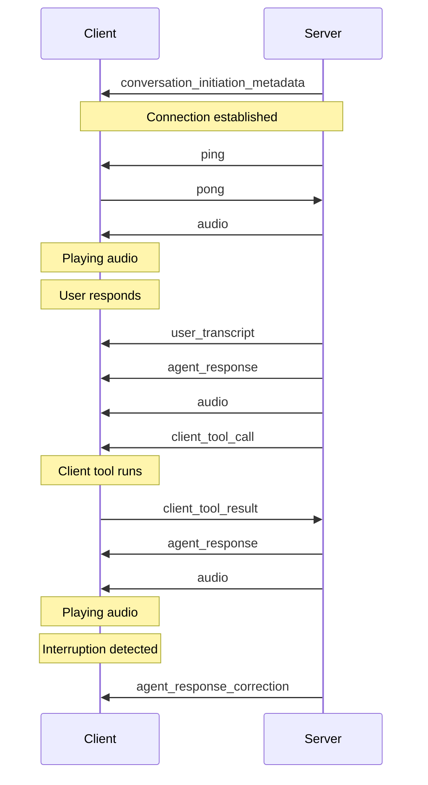

# Client tools

> Empower your assistant to trigger client-side operations.

**Client tools** enable your assistant to execute client-side functions. Unlike [server-side tools](/docs/conversational-ai/customization/tools), client tools allow the assistant to perform actions such as triggering browser events, running client-side functions, or sending notifications to a UI.

## Overview

Applications may require assistants to interact directly with the user's environment. Client-side tools give your assistant the ability to perform client-side operations.

Here are a few examples where client tools can be useful:

* **Triggering UI events**: Allow an assistant to trigger browser events, such as alerts, modals or notifications.
* **Interacting with the DOM**: Enable an assistant to manipulate the Document Object Model (DOM) for dynamic content updates or to guide users through complex interfaces.

<Info>
  To perform operations server-side, use
  [server-tools](/docs/conversational-ai/customization/tools/server-tools) instead.
</Info>

## Guide

### Prerequisites

* An [ElevenLabs account](https://elevenlabs.io)
* A configured ElevenLabs Conversational Agent ([create one here](https://elevenlabs.io/app/conversational-ai))

<Steps>
  <Step title="Create a new client-side tool">
    Navigate to your agent dashboard. In the **Tools** section, click **Add Tool**. Ensure the **Tool Type** is set to **Client**. Then configure the following:

    | Setting     | Parameter                                                        |
    | ----------- | ---------------------------------------------------------------- |
    | Name        | logMessage                                                       |
    | Description | Use this client-side tool to log a message to the user's client. |

    Then create a new parameter `message` with the following configuration:

    | Setting     | Parameter                                                                          |
    | ----------- | ---------------------------------------------------------------------------------- |
    | Data Type   | String                                                                             |
    | Identifier  | message                                                                            |
    | Required    | true                                                                               |
    | Description | The message to log in the console. Ensure the message is informative and relevant. |

    <Frame background="subtle">
      
    </Frame>
  </Step>

  <Step title="Register the client tool in your code">
    Unlike server-side tools, client tools need to be registered in your code.

    Use the following code to register the client tool:

    <CodeBlocks>
      ```python title="Python" focus={4-16}
      from elevenlabs import ElevenLabs
      from elevenlabs.conversational_ai.conversation import Conversation, ClientTools

      def log_message(parameters):
          message = parameters.get("message")
          print(message)

      client_tools = ClientTools()
      client_tools.register("logMessage", log_message)

      conversation = Conversation(
          client=ElevenLabs(api_key="your-api-key"),
          agent_id="your-agent-id",
          client_tools=client_tools,
          # ...
      )

      conversation.start_session()
      ```

      ```javascript title="JavaScript" focus={2-10}
      // ...
      const conversation = await Conversation.startSession({
        // ...
        clientTools: {
          logMessage: async ({message}) => {
            console.log(message);
          }
        },
        // ...
      });
      ```

      ```swift title="Swift" focus={2-10}
      // ...
      var clientTools = ElevenLabsSDK.ClientTools()

      clientTools.register("logMessage") { parameters async throws -> String? in
          guard let message = parameters["message"] as? String else {
              throw ElevenLabsSDK.ClientToolError.invalidParameters
          }
          print(message)
          return message
      }
      ```
    </CodeBlocks>

    <Note>
      The tool and parameter names in the agent configuration are case-sensitive and **must** match those registered in your code.
    </Note>
  </Step>

  <Step title="Testing">
    Initiate a conversation with your agent and say something like:

    > *Log a message to the console that says Hello World*

    You should see a `Hello World` log appear in your console.
  </Step>

  <Step title="Next steps">
    Now that you've set up a basic client-side event, you can:

    * Explore more complex client tools like opening modals, navigating to pages, or interacting with the DOM.
    * Combine client tools with server-side webhooks for full-stack interactions.
    * Use client tools to enhance user engagement and provide real-time feedback during conversations.
  </Step>
</Steps>

### Passing client tool results to the conversation context

When you want your agent to receive data back from a client tool, ensure that you tick the **Wait for response** option in the tool configuration.

<Frame background="subtle">
  
</Frame>

Once the client tool is added, when the function is called the agent will wait for its response and append the response to the conversation context.

<CodeBlocks>
  ```python title="Python"
  def get_customer_details():
      # Fetch customer details (e.g., from an API or database)
      customer_data = {
          "id": 123,
          "name": "Alice",
          "subscription": "Pro"
      }
      # Return the customer data; it can also be a JSON string if needed.
      return customer_data

  client_tools = ClientTools()
  client_tools.register("getCustomerDetails", get_customer_details)

  conversation = Conversation(
      client=ElevenLabs(api_key="your-api-key"),
      agent_id="your-agent-id",
      client_tools=client_tools,
      # ...
  )

  conversation.start_session()
  ```

  ```javascript title="JavaScript"
  const clientTools = {
    getCustomerDetails: async () => {
      // Fetch customer details (e.g., from an API)
      const customerData = {
        id: 123,
        name: "Alice",
        subscription: "Pro"
      };
      // Return data directly to the agent.
      return customerData;
    }
  };

  // Start the conversation with client tools configured.
  const conversation = await Conversation.startSession({ clientTools });
  ```
</CodeBlocks>

In this example, when the agent calls **getCustomerDetails**, the function will execute on the client and the agent will receive the returned data, which is then used as part of the conversation context.

### Troubleshooting

<AccordionGroup>
  <Accordion title="Tools not being triggered">
    * Ensure the tool and parameter names in the agent configuration match those registered in your code.
    * View the conversation transcript in the agent dashboard to verify the tool is being executed.
  </Accordion>

  <Accordion title="Console errors">
    * Open the browser console to check for any errors.
    * Ensure that your code has necessary error handling for undefined or unexpected parameters.
  </Accordion>
</AccordionGroup>

## Best practices

<h4>
  Name tools intuitively, with detailed descriptions
</h4>

If you find the assistant does not make calls to the correct tools, you may need to update your tool names and descriptions so the assistant more clearly understands when it should select each tool. Avoid using abbreviations or acronyms to shorten tool and argument names.

You can also include detailed descriptions for when a tool should be called. For complex tools, you should include descriptions for each of the arguments to help the assistant know what it needs to ask the user to collect that argument.

<h4>
  Name tool parameters intuitively, with detailed descriptions
</h4>

Use clear and descriptive names for tool parameters. If applicable, specify the expected format for a parameter in the description (e.g., YYYY-mm-dd or dd/mm/yy for a date).

<h4>
  Consider providing additional information about how and when to call tools in your assistant's
  system prompt
</h4>

Providing clear instructions in your system prompt can significantly improve the assistant's tool calling accuracy. For example, guide the assistant with instructions like the following:

```plaintext
Use `check_order_status` when the user inquires about the status of their order, such as 'Where is my order?' or 'Has my order shipped yet?'.
```

Provide context for complex scenarios. For example:

```plaintext
Before scheduling a meeting with `schedule_meeting`, check the user's calendar for availability using check_availability to avoid conflicts.
```

<h4>
  LLM selection
</h4>

<Warning>
  When using tools, we recommend picking high intelligence models like GPT-4o mini or Claude 3.5
  Sonnet and avoiding Gemini 1.5 Flash.
</Warning>

It's important to note that the choice of LLM matters to the success of function calls. Some LLMs can struggle with extracting the relevant parameters from the conversation.

# Server tools

> Connect your assistant to external data & systems.

**Tools** enable your assistant to connect to external data and systems. You can define a set of tools that the assistant has access to, and the assistant will use them where appropriate based on the conversation.

## Overview

Many applications require assistants to call external APIs to get real-time information. Tools give your assistant the ability to make external function calls to third party apps so you can get real-time information.

Here are a few examples where tools can be useful:

* **Fetching data**: enable an assistant to retrieve real-time data from any REST-enabled database or 3rd party integration before responding to the user.
* **Taking action**: allow an assistant to trigger authenticated actions based on the conversation, like scheduling meetings or initiating order returns.

<Info>
  To interact with Application UIs or trigger client-side events use [client
  tools](/docs/conversational-ai/customization/tools/client-tools) instead.
</Info>

## Tool configuration

Conversational AI assistants can be equipped with tools to interact with external APIs. Unlike traditional requests, the assistant generates query, body, and path parameters dynamically based on the conversation and parameter descriptions you provide.

All tool configurations and parameter descriptions help the assistant determine **when** and **how** to use these tools. To orchestrate tool usage effectively, update the assistant’s system prompt to specify the sequence and logic for making these calls. This includes:

* **Which tool** to use and under what conditions.
* **What parameters** the tool needs to function properly.
* **How to handle** the responses.

<br />

<Tabs>
  <Tab title="Configuration">
    Define a high-level `Name` and `Description` to describe the tool's purpose. This helps the LLM understand the tool and know when to call it.

    <Info>
      If the API requires path parameters, include variables in the URL path by wrapping them in curly
      braces `{}`, for example: `/api/resource/{id}` where `id` is a path parameter.
    </Info>

    <Frame background="subtle">
      
    </Frame>
  </Tab>

  <Tab title="Secrets">
    Assistant secrets can be used to add authentication headers to requests.

    <Frame background="subtle">
      
    </Frame>
  </Tab>

  <Tab title="Headers">
    Specify any headers that need to be included in the request.

    <Frame background="subtle">
      
    </Frame>
  </Tab>

  <Tab title="Path parameters">
    Include variables in the URL path by wrapping them in curly braces `{}`:

    * **Example**: `/api/resource/{id}` where `id` is a path parameter.

    <Frame background="subtle">
      
    </Frame>
  </Tab>

  <Tab title="Body parameters">
    Specify any body parameters to be included in the request.

    <Frame background="subtle">
      
    </Frame>
  </Tab>

  <Tab title="Query parameters">
    Specify any query parameters to be included in the request.

    <Frame background="subtle">
      
    </Frame>
  </Tab>
</Tabs>

## Guide

In this guide, we'll create a weather assistant that can provide real-time weather information for any location. The assistant will use its geographic knowledge to convert location names into coordinates and fetch accurate weather data.

<div>
  <iframe src="https://player.vimeo.com/video/1061374724?h=bd9bdb535e&badge=0&autopause=0&player_id=0&app_id=58479" frameborder="0" allow="autoplay; fullscreen; picture-in-picture; clipboard-write; encrypted-media" title="weatheragent" />
</div>

<Steps>
  <Step title="Configure the weather tool">
    First, on the **Agent** section of your agent settings page, choose **Add Tool**. Select **Webhook** as the Tool Type, then configure the weather API integration:

    <AccordionGroup>
      <Accordion title="Weather Tool Configuration">
        <Tabs>
          <Tab title="Configuration">
            | Field       | Value                                                                                                                                                                                                                                                                                                                                                                                  |
            | ----------- | -------------------------------------------------------------------------------------------------------------------------------------------------------------------------------------------------------------------------------------------------------------------------------------------------------------------------------------------------------------------------------------- |
            | Name        | get\_weather                                                                                                                                                                                                                                                                                                                                                                           |
            | Description | Gets the current weather forecast for a location                                                                                                                                                                                                                                                                                                                                       |
            | Method      | GET                                                                                                                                                                                                                                                                                                                                                                                    |
            | URL         | [https://api.open-meteo.com/v1/forecast?latitude=\{latitude}\&longitude=\{longitude}\&current=temperature\_2m,wind\_speed\_10m\&hourly=temperature\_2m,relative\_humidity\_2m,wind\_speed\_10m](https://api.open-meteo.com/v1/forecast?latitude=\{latitude}\&longitude=\{longitude}\&current=temperature_2m,wind_speed_10m\&hourly=temperature_2m,relative_humidity_2m,wind_speed_10m) |
          </Tab>

          <Tab title="Path Parameters">
            | Data Type | Identifier | Value Type | Description                                         |
            | --------- | ---------- | ---------- | --------------------------------------------------- |
            | string    | latitude   | LLM Prompt | The latitude coordinate for the requested location  |
            | string    | longitude  | LLM Prompt | The longitude coordinate for the requested location |
          </Tab>
        </Tabs>
      </Accordion>
    </AccordionGroup>

    <Warning>
      An API key is not required for this tool. If one is required, this should be passed in the headers and stored as a secret.
    </Warning>
  </Step>

  <Step title="Orchestration">
    Configure your assistant to handle weather queries intelligently with this system prompt:

    ```plaintext System prompt
    You are a helpful conversational AI assistant with access to a weather tool. When users ask about
    weather conditions, use the get_weather tool to fetch accurate, real-time data. The tool requires
    a latitude and longitude - use your geographic knowledge to convert location names to coordinates
    accurately.

    Never ask users for coordinates - you must determine these yourself. Always report weather
    information conversationally, referring to locations by name only. For weather requests:

    1. Extract the location from the user's message
    2. Convert the location to coordinates and call get_weather
    3. Present the information naturally and helpfully

    For non-weather queries, provide friendly assistance within your knowledge boundaries. Always be
    concise, accurate, and helpful.

    First message: "Hey, how can I help you today?"
    ```

    <Success>
      Test your assistant by asking about the weather in different locations. The assistant should
      handle specific locations ("What's the weather in Tokyo?") and ask for clarification after general queries ("How's
      the weather looking today?").
    </Success>
  </Step>
</Steps>

## Best practices

<h4>
  Name tools intuitively, with detailed descriptions
</h4>

If you find the assistant does not make calls to the correct tools, you may need to update your tool names and descriptions so the assistant more clearly understands when it should select each tool. Avoid using abbreviations or acronyms to shorten tool and argument names.

You can also include detailed descriptions for when a tool should be called. For complex tools, you should include descriptions for each of the arguments to help the assistant know what it needs to ask the user to collect that argument.

<h4>
  Name tool parameters intuitively, with detailed descriptions
</h4>

Use clear and descriptive names for tool parameters. If applicable, specify the expected format for a parameter in the description (e.g., YYYY-mm-dd or dd/mm/yy for a date).

<h4>
  Consider providing additional information about how and when to call tools in your assistant's
  system prompt
</h4>

Providing clear instructions in your system prompt can significantly improve the assistant's tool calling accuracy. For example, guide the assistant with instructions like the following:

```plaintext
Use `check_order_status` when the user inquires about the status of their order, such as 'Where is my order?' or 'Has my order shipped yet?'.
```

Provide context for complex scenarios. For example:

```plaintext
Before scheduling a meeting with `schedule_meeting`, check the user's calendar for availability using check_availability to avoid conflicts.
```

<h4>
  LLM selection
</h4>

<Warning>
  When using tools, we recommend picking high intelligence models like GPT-4o mini or Claude 3.5
  Sonnet and avoiding Gemini 1.5 Flash.
</Warning>

It's important to note that the choice of LLM matters to the success of function calls. Some LLMs can struggle with extracting the relevant parameters from the conversation.


# System tools

> Update the internal state of conversations without external requests.

**System tools** enable your assistant to update the internal state of a conversation. Unlike [server tools](/docs/conversational-ai/customization/tools/server-tools) or [client tools](/docs/conversational-ai/customization/tools/client-tools), system tools don't make external API calls or trigger client-side functions—they modify the internal state of the conversation without making external calls.

## Overview

Some applications require agents to control the flow or state of a conversation.
System tools provide this capability by allowing the assistant to perform actions related to the state of the call that don't require communicating with external servers or the client.

### Available system tools

<CardGroup cols={2}>
  <Card title="End call" icon="duotone square-phone-hangup" href="/docs/conversational-ai/customization/tools/system-tools/end-call">
    Let your agent automatically terminate a conversation when appropriate conditions are met.
  </Card>

  <Card title="Language detection" icon="duotone earth-europe" href="/docs/conversational-ai/customization/tools/system-tools/language-detection">
    Enable your agent to automatically switch to the user's language during conversations.
  </Card>

  <Card title="Agent transfer" icon="duotone arrow-right-arrow-left" href="/docs/conversational-ai/customization/tools/system-tools/agent-transfer">
    Seamlessly transfer conversations between AI agents based on defined conditions.
  </Card>

  <Card title="Transfer to human" icon="duotone user-headset" href="/docs/conversational-ai/customization/tools/system-tools/transfer-to-human">
    Seamlessly transfer the user to a human operator.
  </Card>

  <Card title="Skip turn" icon="duotone forward" href="/docs/conversational-ai/customization/tools/system-tools/skip-turn">
    Enable the agent to skip their turns if the LLM detects the agent should not speak yet.
  </Card>
</CardGroup>

## Implementation

When creating an agent via API, you can add system tools to your agent configuration. Here's how to implement both the end call and language detection tools:

<CodeGroup>
  ```python
  from elevenlabs import (
      ConversationalConfig,
      ElevenLabs,
      AgentConfig,
      PromptAgent,
      PromptAgentInputToolsItem_System,
  )

  # Initialize the client
  elevenlabs = ElevenLabs(api_key="YOUR_API_KEY")

  # Create system tools
  end_call_tool = PromptAgentInputToolsItem_System(
      name="end_call",
      description=""  # Optional: Customize when the tool should be triggered
  )

  language_detection_tool = PromptAgentInputToolsItem_System(
      name="language_detection",
      description=""  # Optional: Customize when the tool should be triggered
  )

  # Create the agent configuration with both tools
  conversation_config = ConversationalConfig(
      agent=AgentConfig(
          prompt=PromptAgent(
              tools=[end_call_tool, language_detection_tool]
          )
      )
  )

  # Create the agent
  response = elevenlabs.conversational_ai.agents.create(
      conversation_config=conversation_config
  )
  ```

  ```javascript
  import { ElevenLabs } from '@elevenlabs/elevenlabs-js';

  // Initialize the client
  const elevenlabs = new ElevenLabs({
    apiKey: 'YOUR_API_KEY',
  });

  // Create the agent with system tools
  await elevenlabs.conversationalAi.agents.create({
    conversationConfig: {
      agent: {
        prompt: {
          tools: [
            {
              type: 'system',
              name: 'end_call',
              description: '',
            },
            {
              type: 'system',
              name: 'language_detection',
              description: '',
            },
          ],
        },
      },
    },
  });
  ```
</CodeGroup>

## FAQ

<AccordionGroup>
  <Accordion title="Can system tools be combined with other tool types?">
    Yes, system tools can be used alongside server tools and client tools in the same assistant.
    This allows for comprehensive functionality that combines internal state management with
    external interactions.
  </Accordion>
</AccordionGroup>

```
```# End call

> Let your agent automatically hang up on the user.

<Warning>
  The **End Call** tool is added to agents created in the ElevenLabs dashboard by default. For
  agents created via API or SDK, if you would like to enable the End Call tool, you must add it
  manually as a system tool in your agent configuration. [See API Implementation
  below](#api-implementation) for details.
</Warning>

<Frame background="subtle">
  
</Frame>

## Overview

The **End Call** tool allows your conversational agent to terminate a call with the user. This is a system tool that provides flexibility in how and when calls are ended.

## Functionality

* **Default behavior**: The tool can operate without any user-defined prompts, ending the call when the conversation naturally concludes.
* **Custom prompts**: Users can specify conditions under which the call should end. For example:
  * End the call if the user says "goodbye."
  * Conclude the call when a specific task is completed.

### API Implementation

When creating an agent via API, you can add the End Call tool to your agent configuration. It should be defined as a system tool:

<CodeBlocks>
  ```python
  from elevenlabs import (
      ConversationalConfig,
      ElevenLabs,
      AgentConfig,
      PromptAgent,
      PromptAgentInputToolsItem_System
  )

  # Initialize the client
  elevenlabs = ElevenLabs(api_key="YOUR_API_KEY")

  # Create the end call tool
  end_call_tool = PromptAgentInputToolsItem_System(
      name="end_call",
      description=""  # Optional: Customize when the tool should be triggered
  )

  # Create the agent configuration
  conversation_config = ConversationalConfig(
      agent=AgentConfig(
          prompt=PromptAgent(
              tools=[end_call_tool]
          )
      )
  )

  # Create the agent
  response = elevenlabs.conversational_ai.agents.create(
      conversation_config=conversation_config
  )
  ```

  ```javascript
  import { ElevenLabs } from '@elevenlabs/elevenlabs-js';

  // Initialize the client
  const elevenlabs = new ElevenLabs({
    apiKey: 'YOUR_API_KEY',
  });

  // Create the agent with end call tool
  await elevenlabs.conversationalAi.agents.create({
    conversationConfig: {
      agent: {
        prompt: {
          tools: [
            {
              type: 'system',
              name: 'end_call',
              description: '', // Optional: Customize when the tool should be triggered
            },
          ],
        },
      },
    },
  });
  ```

  ```bash
  curl -X POST https://api.elevenlabs.io/v1/convai/agents/create \
       -H "xi-api-key: YOUR_API_KEY" \
       -H "Content-Type: application/json" \
       -d '{
    "conversation_config": {
      "agent": {
        "prompt": {
          "tools": [
            {
              "type": "system",
              "name": "end_call",
              "description": ""
            }
          ]
        }
      }
    }
  }'
  ```
</CodeBlocks>

<Tip>
  Leave the description blank to use the default end call prompt.
</Tip>

## Example prompts

**Example 1: Basic End Call**

```
End the call when the user says goodbye, thank you, or indicates they have no more questions.
```

**Example 2: End Call with Custom Prompt**

```
End the call when the user says goodbye, thank you, or indicates they have no more questions. You can only end the call after all their questions have been answered. Please end the call only after confirming that the user doesn't need any additional assistance.
```
# Language detection

> Let your agent automatically switch to the language

## Overview

The `language detection` system tool allows your Conversational AI agent to switch its output language to any the agent supports.
This system tool is not enabled automatically. Its description can be customized to accommodate your specific use case.

<iframe width="100%" height="400" src="https://www.youtube-nocookie.com/embed/YhF2gKv9ozc" title="YouTube video player" frameborder="0" allow="accelerometer; autoplay; clipboard-write; encrypted-media; gyroscope; picture-in-picture; web-share" allowfullscreen />

<Note>
  Where possible, we recommend enabling all languages for an agent and enabling the language
  detection system tool.
</Note>

Our language detection tool triggers language switching in two cases, both based on the received audio's detected language and content:

* `detection` if a user speaks a different language than the current output language, a switch will be triggered
* `content` if the user asks in the current language to change to a new language, a switch will be triggered

## Enabling language detection

<Steps>
  <Step title="Configure supported languages">
    The languages that the agent can switch to must be defined in the `Agent` settings tab.

    <Frame background="subtle">
      
    </Frame>
  </Step>

  <Step title="Add the language detection tool">
    Enable language detection by selecting the pre-configured system tool to your agent's tools in the `Agent` tab.
    This is automatically available as an option when selecting `add tool`.

    <Frame background="subtle">
      
    </Frame>
  </Step>

  <Step title="Configure tool description">
    Add a description that specifies when to call the tool

    <Frame background="subtle">
      
    </Frame>
  </Step>
</Steps>

### API Implementation

When creating an agent via API, you can add the `language detection` tool to your agent configuration. It should be defined as a system tool:

<CodeBlocks>
  ```python
  from elevenlabs import (
      ConversationalConfig,
      ElevenLabs,
      AgentConfig,
      PromptAgent,
      PromptAgentInputToolsItem_System,
      LanguagePresetInput,
      ConversationConfigClientOverrideInput,
      AgentConfigOverride,
  )

  # Initialize the client
  elevenlabs = ElevenLabs(api_key="YOUR_API_KEY")

  # Create the language detection tool
  language_detection_tool = PromptAgentInputToolsItem_System(
      name="language_detection",
      description=""  # Optional: Customize when the tool should be triggered
  )

  # Create language presets
  language_presets = {
      "nl": LanguagePresetInput(
          overrides=ConversationConfigClientOverrideInput(
              agent=AgentConfigOverride(
                  prompt=None,
                  first_message="Hoi, hoe gaat het met je?",
                  language=None
              ),
              tts=None
          ),
          first_message_translation=None
      ),
      "fi": LanguagePresetInput(
          overrides=ConversationConfigClientOverrideInput(
              agent=AgentConfigOverride(
                  first_message="Hei, kuinka voit?",
              ),
              tts=None
          ),
      ),
      "tr": LanguagePresetInput(
          overrides=ConversationConfigClientOverrideInput(
              agent=AgentConfigOverride(
                  prompt=None,
                  first_message="Merhaba, nasılsın?",
                  language=None
              ),
              tts=None
          ),
      ),
      "ru": LanguagePresetInput(
          overrides=ConversationConfigClientOverrideInput(
              agent=AgentConfigOverride(
                  prompt=None,
                  first_message="Привет, как ты?",
                  language=None
              ),
              tts=None
          ),
      ),
      "pt": LanguagePresetInput(
          overrides=ConversationConfigClientOverrideInput(
              agent=AgentConfigOverride(
                  prompt=None,
                  first_message="Oi, como você está?",
                  language=None
              ),
              tts=None
          ),
      )
  }

  # Create the agent configuration
  conversation_config = ConversationalConfig(
      agent=AgentConfig(
          prompt=PromptAgent(
              tools=[language_detection_tool],
              first_message="Hi how are you?"
          )
      ),
      language_presets=language_presets
  )

  # Create the agent
  response = elevenlabs.conversational_ai.agents.create(
      conversation_config=conversation_config
  )
  ```

  ```javascript
  import { ElevenLabs } from '@elevenlabs/elevenlabs-js';

  // Initialize the client
  const elevenlabs = new ElevenLabs({
    apiKey: 'YOUR_API_KEY',
  });

  // Create the agent with language detection tool
  await elevenlabs.conversationalAi.agents.create({
    conversationConfig: {
      agent: {
        prompt: {
          tools: [
            {
              type: 'system',
              name: 'language_detection',
              description: '', // Optional: Customize when the tool should be triggered
            },
          ],
          firstMessage: 'Hi, how are you?',
        },
      },
      languagePresets: {
        nl: {
          overrides: {
            agent: {
              prompt: null,
              firstMessage: 'Hoi, hoe gaat het met je?',
              language: null,
            },
            tts: null,
          },
        },
        fi: {
          overrides: {
            agent: {
              prompt: null,
              firstMessage: 'Hei, kuinka voit?',
              language: null,
            },
            tts: null,
          },
          firstMessageTranslation: {
            sourceHash: '{"firstMessage":"Hi how are you?","language":"en"}',
            text: 'Hei, kuinka voit?',
          },
        },
        tr: {
          overrides: {
            agent: {
              prompt: null,
              firstMessage: 'Merhaba, nasılsın?',
              language: null,
            },
            tts: null,
          },
        },
        ru: {
          overrides: {
            agent: {
              prompt: null,
              firstMessage: 'Привет, как ты?',
              language: null,
            },
            tts: null,
          },
        },
        pt: {
          overrides: {
            agent: {
              prompt: null,
              firstMessage: 'Oi, como você está?',
              language: null,
            },
            tts: null,
          },
        },
        ar: {
          overrides: {
            agent: {
              prompt: null,
              firstMessage: 'مرحبًا كيف حالك؟',
              language: null,
            },
            tts: null,
          },
        },
      },
    },
  });
  ```

  ```bash
  curl -X POST https://api.elevenlabs.io/v1/convai/agents/create \
       -H "xi-api-key: YOUR_API_KEY" \
       -H "Content-Type: application/json" \
       -d '{
    "conversation_config": {
      "agent": {
        "prompt": {
          "first_message": "Hi how are you?",
          "tools": [
            {
              "type": "system",
              "name": "language_detection",
              "description": ""
            }
          ]
        }
      },
      "language_presets": {
        "nl": {
          "overrides": {
            "agent": {
              "prompt": null,
              "first_message": "Hoi, hoe gaat het met je?",
              "language": null
            },
            "tts": null
          }
        },
        "fi": {
          "overrides": {
            "agent": {
              "prompt": null,
              "first_message": "Hei, kuinka voit?",
              "language": null
            },
            "tts": null
          }
        },
        "tr": {
          "overrides": {
            "agent": {
              "prompt": null,
              "first_message": "Merhaba, nasılsın?",
              "language": null
            },
            "tts": null
          }
        },
        "ru": {
          "overrides": {
            "agent": {
              "prompt": null,
              "first_message": "Привет, как ты?",
              "language": null
            },
            "tts": null
          }
        },
        "pt": {
          "overrides": {
            "agent": {
              "prompt": null,
              "first_message": "Oi, como você está?",
              "language": null
            },
            "tts": null
          }
        },
        "ar": {
          "overrides": {
            "agent": {
              "prompt": null,
              "first_message": "مرحبًا كيف حالك؟",
              "language": null
            },
            "tts": null
          }
        }
      }
    }
  }'
  ```
</CodeBlocks>

<Tip>
  Leave the description blank to use the default language detection prompt.
</Tip>

# Agent transfer

> Seamlessly transfer the user between Conversational AI agents based on defined conditions.

## Overview

Agent-agent transfer allows a Conversational AI agent to hand off the ongoing conversation to another designated agent when specific conditions are met. This enables the creation of sophisticated, multi-layered conversational workflows where different agents handle specific tasks or levels of complexity.

For example, an initial agent (Orchestrator) could handle general inquiries and then transfer the call to a specialized agent based on the conversation's context. Transfers can also be nested:

<Frame background="subtle" caption="Example Agent Transfer Hierarchy">
  ```text
  Orchestrator Agent (Initial Qualification)
  │
  ├───> Agent 1 (e.g., Availability Inquiries)
  │
  ├───> Agent 2 (e.g., Technical Support)
  │     │
  │     └───> Agent 2a (e.g., Hardware Support)
  │
  └───> Agent 3 (e.g., Billing Issues)

  ```
</Frame>

<Note>
  We recommend using the `gpt-4o` or `gpt-4o-mini` models when using agent-agent transfers due to better tool calling.
</Note>

## Enabling agent transfer

Agent transfer is configured using the `transfer_to_agent` system tool.

<Steps>
  <Step title="Add the transfer tool">
    Enable agent transfer by selecting the `transfer_to_agent` system tool in your agent's configuration within the `Agent` tab. Choose "Transfer to AI Agent" when adding a tool.

    <Frame background="subtle">
      
    </Frame>
  </Step>

  <Step title="Configure tool description (optional)">
    You can provide a custom description to guide the LLM on when to trigger a transfer. If left blank, a default description encompassing the defined transfer rules will be used.

    <Frame background="subtle">
      
    </Frame>
  </Step>

  <Step title="Define transfer rules">
    Configure the specific rules for transferring to other agents. For each rule, specify:

    * **Agent**: The target agent to transfer the conversation to.
    * **Condition**: A natural language description of the circumstances under which the transfer should occur (e.g., "User asks about billing details", "User requests technical support for product X").

    The LLM will use these conditions, along with the tool description, to decide when and to which agent (by number) to transfer.

    <Frame background="subtle">
      
    </Frame>

    <Note>
      Ensure that the user account creating the agent has at least viewer permissions for any target agents specified in the transfer rules.
    </Note>
  </Step>
</Steps>

## API Implementation

You can configure the `transfer_to_agent` system tool when creating or updating an agent via the API.

<CodeBlocks>
  ```python
  from elevenlabs import (
      ConversationalConfig,
      ElevenLabs,
      AgentConfig,
      PromptAgent,
      PromptAgentInputToolsItem_System,
      SystemToolConfigInputParams_TransferToAgent,
      AgentTransfer
  )

  # Initialize the client
  elevenlabs = ElevenLabs(api_key="YOUR_API_KEY")

  # Define transfer rules
  transfer_rules = [
      AgentTransfer(agent_id="AGENT_ID_1", condition="When the user asks for billing support."),
      AgentTransfer(agent_id="AGENT_ID_2", condition="When the user requests advanced technical help.")
  ]

  # Create the transfer tool configuration
  transfer_tool = PromptAgentInputToolsItem_System(
      type="system",
      name="transfer_to_agent",
      description="Transfer the user to a specialized agent based on their request.", # Optional custom description
      params=SystemToolConfigInputParams_TransferToAgent(
          transfers=transfer_rules
      )
  )

  # Create the agent configuration
  conversation_config = ConversationalConfig(
      agent=AgentConfig(
          prompt=PromptAgent(
              prompt="You are a helpful assistant.",
              first_message="Hi, how can I help you today?",
              tools=[transfer_tool],
          )
      )
  )

  # Create the agent
  response = elevenlabs.conversational_ai.agents.create(
      conversation_config=conversation_config
  )

  print(response)
  ```

  ```javascript
  import { ElevenLabs } from '@elevenlabs/elevenlabs-js';

  // Initialize the client
  const elevenlabs = new ElevenLabs({
    apiKey: 'YOUR_API_KEY',
  });

  // Define transfer rules
  const transferRules = [
    { agentId: 'AGENT_ID_1', condition: 'When the user asks for billing support.' },
    { agentId: 'AGENT_ID_2', condition: 'When the user requests advanced technical help.' },
  ];

  // Create the agent with the transfer tool
  await elevenlabs.conversationalAi.agents.create({
    conversationConfig: {
      agent: {
        prompt: {
          prompt: 'You are a helpful assistant.',
          firstMessage: 'Hi, how can I help you today?',
          tools: [
            {
              type: 'system',
              name: 'transfer_to_agent',
              description: 'Transfer the user to a specialized agent based on their request.', // Optional custom description
              params: {
                systemToolType: 'transfer_to_agent',
                transfers: transferRules,
              },
            },
          ],
        },
      },
    },
  });
  ```
</CodeBlocks>

# Transfer to human

> Seamlessly transfer the user to a human operator via phone number based on defined conditions.

## Overview

Human transfer allows a Conversational AI agent to transfer the ongoing call to a specified phone number when certain conditions are met. This enables agents to hand off complex issues, specific requests, or situations requiring human intervention to a live operator.

This feature utilizes the `transfer_to_number` system tool which supports transfers via Twilio and SIP trunk numbers. When triggered, the agent can provide a message to the user while they wait and a separate message summarizing the situation for the human operator receiving the call.

## Numbers that can be transferred to

Currently only [SIP trunking](/docs/conversational-ai/phone-numbers/sip-trunking) phone numbers support transferring to external numbers.
[Twilio phone numbers](/docs/conversational-ai/phone-numbers/twilio-integration/native-integration) currently can only transfer to phone numbers hosted on Twilio. If this is needed we recommended using Twilio numbers via [Twilio elastic SIP trunking](https://www.twilio.com/docs/sip-trunking) and our SIP trunking support, rather than via the native integration.

## Enabling human transfer

Human transfer is configured using the `transfer_to_number` system tool.

<Steps>
  <Step title="Add the transfer tool">
    Enable human transfer by selecting the `transfer_to_number` system tool in your agent's configuration within the `Agent` tab. Choose "Transfer to Human" when adding a tool.

    <Frame background="subtle" caption="Select 'Transfer to Human' tool">
      {/* Placeholder for image showing adding the 'Transfer to Human' tool */}

      
    </Frame>
  </Step>

  <Step title="Configure tool description (optional)">
    You can provide a custom description to guide the LLM on when to trigger a transfer. If left blank, a default description encompassing the defined transfer rules will be used.

    <Frame background="subtle" caption="Configure transfer tool description">
      {/* Placeholder for image showing the tool description field */}

      
    </Frame>
  </Step>

  <Step title="Define transfer rules">
    Configure the specific rules for transferring to phone numbers. For each rule, specify:

    * **Phone Number**: The target phone number in E.164 format (e.g., +12125551234) to transfer the call to.
    * **Condition**: A natural language description of the circumstances under which the transfer should occur (e.g., "User explicitly requests to speak to a human", "User needs to update sensitive account information").

    The LLM will use these conditions, along with the tool description, to decide when and to which phone number to transfer.

    <Frame background="subtle" caption="Define transfer rules with phone number and condition">
      {/* Placeholder for image showing transfer rules configuration */}

      
    </Frame>

    <Note>
      Ensure the phone number is correctly formatted (E.164) and associated with a properly configured Twilio account capable of receiving calls.
    </Note>
  </Step>
</Steps>

## API Implementation

You can configure the `transfer_to_number` system tool when creating or updating an agent via the API. The tool allows specifying messages for both the client (user being transferred) and the agent (human operator receiving the call).

<CodeBlocks>
  ```python
  from elevenlabs import (
      ConversationalConfig,
      ElevenLabs,
      AgentConfig,
      PromptAgent,
      PromptAgentInputToolsItem_System,
      SystemToolConfigInputParams_TransferToNumber,
      PhoneNumberTransfer,
  )

  # Initialize the client
  elevenlabs = ElevenLabs(api_key="YOUR_API_KEY")

  # Define transfer rules
  transfer_rules = [
      PhoneNumberTransfer(phone_number="+15551234567", condition="When the user asks for billing support."),
      PhoneNumberTransfer(phone_number="+15559876543", condition="When the user requests to file a formal complaint.")
  ]

  # Create the transfer tool configuration
  transfer_tool = PromptAgentInputToolsItem_System(
      type="system",
      name="transfer_to_human",
      description="Transfer the user to a specialized agent based on their request.", # Optional custom description
      params=SystemToolConfigInputParams_TransferToNumber(
          transfers=transfer_rules
      )
  )

  # Create the agent configuration
  conversation_config = ConversationalConfig(
      agent=AgentConfig(
          prompt=PromptAgent(
              prompt="You are a helpful assistant.",
              first_message="Hi, how can I help you today?",
              tools=[transfer_tool],
          )
      )
  )

  # Create the agent
  response = elevenlabs.conversational_ai.agents.create(
      conversation_config=conversation_config
  )

  # Note: When the LLM decides to call this tool, it needs to provide:
  # - transfer_number: The phone number to transfer to (must match one defined in rules).
  # - client_message: Message read to the user during transfer.
  # - agent_message: Message read to the human operator receiving the call.
  ```

  ```javascript
  import { ElevenLabs } from '@elevenlabs/elevenlabs-js';

  // Initialize the client
  const elevenlabs = new ElevenLabs({
    apiKey: 'YOUR_API_KEY',
  });

  // Define transfer rules
  const transferRules = [
    { phoneNumber: '+15551234567', condition: 'When the user asks for billing support.' },
    { phoneNumber: '+15559876543', condition: 'When the user requests to file a formal complaint.' },
  ];

  // Create the agent with the transfer tool
  await elevenlabs.conversationalAi.agents.create({
    conversationConfig: {
      agent: {
        prompt: {
          prompt: 'You are a helpful assistant.',
          firstMessage: 'Hi, how can I help you today?',
          tools: [
            {
              type: 'system',
              name: 'transfer_to_number',
              description: 'Transfer the user to a human operator based on their request.', // Optional custom description
              params: {
                systemToolType: 'transfer_to_number',
                transfers: transferRules,
              },
            },
          ],
        },
      },
    },
  });

  // Note: When the LLM decides to call this tool, it needs to provide:
  // - transfer_number: The phone number to transfer to (must match one defined in rules).
  // - client_message: Message read to the user during transfer.
  // - agent_message: Message read to the human operator receiving the call.
  </code_block_to_apply_changes_from>
  ```
</CodeBlocks>

# Skip turn

> Allow your agent to pause and wait for the user to speak next.

## Overview

The **Skip Turn** tool allows your conversational agent to explicitly pause and wait for the user to speak or act before continuing. This system tool is useful when the user indicates they need a moment, for example, by saying "Give me a second," "Let me think," or "One moment please."

## Functionality

* **User-Initiated Pause**: The tool is designed to be invoked by the LLM when it detects that the user needs a brief pause without interruption.
* **No Verbal Response**: After this tool is called, the assistant will not speak. It waits for the user to re-engage or for another turn-taking condition to be met.
* **Seamless Conversation Flow**: It helps maintain a natural conversational rhythm by respecting the user's need for a short break without ending the interaction or the agent speaking unnecessarily.

The tool itself has no parameters that the LLM needs to provide.

### API implementation

When creating an agent via API, you can add the Skip Turn tool to your agent configuration. It should be defined as a system tool, with the name `skip_turn`.

<CodeBlocks>
  ```python
  from elevenlabs import (
      ConversationalConfig,
      ElevenLabs,
      AgentConfig,
      PromptAgent,
      PromptAgentInputToolsItem_System
  )

  # Initialize the client
  elevenlabs = ElevenLabs(api_key="YOUR_API_KEY")

  # Create the skip turn tool
  skip_turn_tool = PromptAgentInputToolsItem_System(
      name="skip_turn",
      description=""  # Optional: Customize when the tool should be triggered, or leave blank for default.
  )

  # Create the agent configuration
  conversation_config = ConversationalConfig(
      agent=AgentConfig(
          prompt=PromptAgent(
              tools=[skip_turn_tool]
          )
      )
  )

  # Create the agent
  response = elevenlabs.conversational_ai.agents.create(
      conversation_config=conversation_config
  )
  ```

  ```javascript
  import { ElevenLabs } from '@elevenlabs/elevenlabs-js';

  // Initialize the client
  const elevenlabs = new ElevenLabs({
    apiKey: 'YOUR_API_KEY',
  });

  // Create the agent with skip turn tool
  await elevenlabs.conversationalAi.agents.create({
    conversationConfig: {
      agent: {
        prompt: {
          tools: [
            {
              type: 'system',
              name: 'skip_turn',
              description: '', // Optional: Customize when the tool should be triggered, or leave blank for default.
            },
          ],
        },
      },
    },
  });
  ```
</CodeBlocks>

## UI configuration

You can also configure the Skip Turn tool directly within the Agent's UI, in the tools section.

<Steps>
  ### Step 1: Add a new tool

  Navigate to your agent's configuration page. In the "Tools" section, click on "Add tool", the `Skip Turn` option will already be available.

  <Frame background="subtle">
    
  </Frame>

  ### Step 2: Configure the tool

  You can optionally provide a description to customize when the LLM should trigger this tool, or leave it blank to use the default behavior.

  <Frame background="subtle">
    
  </Frame>

  ### Step 3: Enable the tool

  Once configured, the `Skip Turn` tool will appear in your agent's list of enabled tools and the agent will be able to skip turns. .

  <Frame background="subtle">
    
  </Frame>
</Steps>

# Client events

> Understand and handle real-time events received by the client during conversational applications.

**Client events** are system-level events sent from the server to the client that facilitate real-time communication. These events deliver audio, transcription, agent responses, and other critical information to the client application.

<Note>
  For information on events you can send from the client to the server, see the [Client-to-server
  events](/docs/conversational-ai/customization/events/client-to-server-events) documentation.
</Note>

## Overview

Client events are essential for maintaining the real-time nature of conversations. They provide everything from initialization metadata to processed audio and agent responses.

<Info>
  These events are part of the WebSocket communication protocol and are automatically handled by our
  SDKs. Understanding them is crucial for advanced implementations and debugging.
</Info>

## Client event types

<AccordionGroup>
  <Accordion title="conversation_initiation_metadata">
    * Automatically sent when starting a conversation
    * Initializes conversation settings and parameters

    ```javascript
    // Example initialization metadata
    {
      "type": "conversation_initiation_metadata",
      "conversation_initiation_metadata_event": {
        "conversation_id": "conv_123",
        "agent_output_audio_format": "pcm_44100",  // TTS output format
        "user_input_audio_format": "pcm_16000"    // ASR input format
      }
    }
    ```
  </Accordion>

  <Accordion title="ping">
    * Health check event requiring immediate response
    * Automatically handled by SDK
    * Used to maintain WebSocket connection

      ```javascript
      // Example ping event structure
      {
        "ping_event": {
          "event_id": 123456,
          "ping_ms": 50  // Optional, estimated latency in milliseconds
        },
        "type": "ping"
      }
      ```

      ```javascript
      // Example ping handler
      websocket.on('ping', () => {
        websocket.send('pong');
      });
      ```
  </Accordion>

  <Accordion title="audio">
    * Contains base64 encoded audio for playback
    * Includes numeric event ID for tracking and sequencing
    * Handles voice output streaming

    ```javascript
    // Example audio event structure
    {
      "audio_event": {
        "audio_base_64": "base64_encoded_audio_string",
        "event_id": 12345
      },
      "type": "audio"
    }
    ```

    ```javascript
    // Example audio event handler
    websocket.on('audio', (event) => {
      const { audio_event } = event;
      const { audio_base_64, event_id } = audio_event;
      audioPlayer.play(audio_base_64);
    });
    ```
  </Accordion>

  <Accordion title="user_transcript">
    * Contains finalized speech-to-text results
    * Represents complete user utterances
    * Used for conversation history

    ```javascript
    // Example transcript event structure
    {
      "type": "user_transcript",
      "user_transcription_event": {
        "user_transcript": "Hello, how can you help me today?"
      }
    }
    ```

    ```javascript
    // Example transcript handler
    websocket.on('user_transcript', (event) => {
      const { user_transcription_event } = event;
      const { user_transcript } = user_transcription_event;
      updateConversationHistory(user_transcript);
    });
    ```
  </Accordion>

  <Accordion title="agent_response">
    * Contains complete agent message
    * Sent with first audio chunk
    * Used for display and history

    ```javascript
    // Example response event structure
    {
      "type": "agent_response",
      "agent_response_event": {
        "agent_response": "Hello, how can I assist you today?"
      }
    }
    ```

    ```javascript
    // Example response handler
    websocket.on('agent_response', (event) => {
      const { agent_response_event } = event;
      const { agent_response } = agent_response_event;
      displayAgentMessage(agent_response);
    });
    ```
  </Accordion>

  <Accordion title="agent_response_correction">
    * Contains truncated response after interruption
      * Updates displayed message
      * Maintains conversation accuracy

    ```javascript
    // Example response correction event structure
    {
      "type": "agent_response_correction",
      "agent_response_correction_event": {
        "original_agent_response": "Let me tell you about the complete history...",
        "corrected_agent_response": "Let me tell you about..."  // Truncated after interruption
      }
    }
    ```

    ```javascript
    // Example response correction handler
    websocket.on('agent_response_correction', (event) => {
      const { agent_response_correction_event } = event;
      const { corrected_agent_response } = agent_response_correction_event;
      displayAgentMessage(corrected_agent_response);
    });
    ```
  </Accordion>

  <Accordion title="client_tool_call">
    * Represents a function call the agent wants the client to execute
    * Contains tool name, tool call ID, and parameters
    * Requires client-side execution of the function and sending the result back to the server

    <Info>
      If you are using the SDK, callbacks are provided to handle sending the result back to the server.
    </Info>

    ```javascript
    // Example tool call event structure
    {
      "type": "client_tool_call",
      "client_tool_call": {
        "tool_name": "search_database",
        "tool_call_id": "call_123456",
        "parameters": {
          "query": "user information",
          "filters": {
            "date": "2024-01-01"
          }
        }
      }
    }
    ```

    ```javascript
    // Example tool call handler
    websocket.on('client_tool_call', async (event) => {
      const { client_tool_call } = event;
      const { tool_name, tool_call_id, parameters } = client_tool_call;

      try {
        const result = await executeClientTool(tool_name, parameters);
        // Send success response back to continue conversation
        websocket.send({
          type: "client_tool_result",
          tool_call_id: tool_call_id,
          result: result,
          is_error: false
        });
      } catch (error) {
        // Send error response if tool execution fails
        websocket.send({
          type: "client_tool_result",
          tool_call_id: tool_call_id,
          result: error.message,
          is_error: true
        });
      }
    });
    ```
  </Accordion>

  <Accordion title="vad_score">
    * Voice Activity Detection score event
    * Indicates the probability that the user is speaking
    * Values range from 0 to 1, where higher values indicate higher confidence of speech

    ```javascript
    // Example VAD score event
    {
      "type": "vad_score",
      "vad_score_event": {
        "vad_score": 0.95
      }
    }
    ```
  </Accordion>
</AccordionGroup>

## Event flow

Here's a typical sequence of events during a conversation:



### Best practices

1. **Error handling**

   * Implement proper error handling for each event type
   * Log important events for debugging
   * Handle connection interruptions gracefully

2. **Audio management**

   * Buffer audio chunks appropriately
   * Implement proper cleanup on interruption
   * Handle audio resource management

3. **Connection management**

   * Respond to PING events promptly
   * Implement reconnection logic
   * Monitor connection health

## Troubleshooting

<AccordionGroup>
  <Accordion title="Connection issues">
    * Ensure proper WebSocket connection
    * Check PING/PONG responses
    * Verify API credentials
  </Accordion>

  <Accordion title="Audio problems">
    * Check audio chunk handling
    * Verify audio format compatibility
    * Monitor memory usage
  </Accordion>

  <Accordion title="Event handling">
    * Log all events for debugging
    * Implement error boundaries
    * Check event handler registration
  </Accordion>
</AccordionGroup>

<Info>
  For detailed implementation examples, check our [SDK
  documentation](/docs/conversational-ai/libraries/python).
</Info>

# Client to server events

> Send contextual information from the client to enhance conversational applications in real-time.

**Client-to-server events** are messages that your application proactively sends to the server to provide additional context during conversations. These events enable you to enhance the conversation with relevant information without interrupting the conversational flow.

<Note>
  For information on events the server sends to the client, see the [Client
  events](/docs/conversational-ai/customization/events/client-events) documentation.
</Note>

## Overview

Your application can send contextual information to the server to improve conversation quality and relevance at any point during the conversation. This does not have to be in response to a client event received from the server. This is particularly useful for sharing UI state, user actions, or other environmental data that may not be directly communicated through voice.

<Info>
  While our SDKs provide helper methods for sending these events, understanding the underlying
  protocol is valuable for custom implementations and advanced use cases.
</Info>

## Event types

### Contextual updates

Contextual updates allow your application to send non-interrupting background information to the conversation.

**Key characteristics:**

* Updates are incorporated as background information in the conversation.
* Does not interrupt the current conversation flow.
* Useful for sending UI state, user actions, or environmental data.

```javascript
// Contextual update event structure
{
  "type": "contextual_update",
  "text": "User appears to be looking at pricing page"
}
```

```javascript
// Example sending contextual updates
function sendContextUpdate(information) {
  websocket.send(
    JSON.stringify({
      type: 'contextual_update',
      text: information,
    })
  );
}

// Usage examples
sendContextUpdate('Customer status: Premium tier');
sendContextUpdate('User navigated to Help section');
sendContextUpdate('Shopping cart contains 3 items');
```

### User messages

User messages allow you to send text directly to the conversation as if the user had spoken it. This is useful for text-based interactions or when you want to inject specific text into the conversation flow.

**Key characteristics:**

* Text is processed as user input to the conversation.
* Triggers the same response flow as spoken user input.
* Useful for text-based interfaces or programmatic user input.

```javascript
// User message event structure
{
  "type": "user_message",
  "text": "I would like to upgrade my account"
}
```

```javascript
// Example sending user messages
function sendUserMessage(text) {
  websocket.send(
    JSON.stringify({
      type: 'user_message',
      text: text,
    })
  );
}

// Usage examples
sendUserMessage('I need help with billing');
sendUserMessage('What are your pricing options?');
sendUserMessage('Cancel my subscription');
```

### User activity

User activity events serve as indicators to prevent interrupts from the agent.

**Key characteristics:**

* Resets the turn timeout timer.
* Does not affect conversation content or flow.
* Useful for maintaining long-running conversations during periods of silence.

```javascript
// User activity event structure
{
  "type": "user_activity"
}
```

```javascript
// Example sending user activity
function sendUserActivity() {
  websocket.send(
    JSON.stringify({
      type: 'user_activity',
    })
  );
}

// Usage example - send activity ping every 30 seconds
setInterval(sendUserActivity, 30000);
```

## Best practices

1. **Contextual updates**

   * Send relevant but concise contextual information.
   * Avoid overwhelming the LLM with too many updates.
   * Focus on information that impacts the conversation flow or is important context from activity in a UI not accessible to the voice agent.

2. **User messages**

   * Use for text-based user input when audio is not available or appropriate.
   * Ensure text content is clear and well-formatted.
   * Consider the conversation context when injecting programmatic messages.

3. **User activity**

   * Send activity pings during periods of user interaction to maintain session.
   * Use reasonable intervals (e.g., 30-60 seconds) to avoid unnecessary network traffic.
   * Implement activity detection based on actual user engagement (mouse movement, typing, etc.).

4. **Timing considerations**

   * Send updates at appropriate moments.
   * Consider grouping multiple contextual updates into a single update (instead of sending every small change separately).
   * Balance between keeping the session alive and avoiding excessive messaging.

<Info>
  For detailed implementation examples, check our [SDK
  documentation](/docs/conversational-ai/libraries/python).
</Info>
# Knowledge base dashboard

> Learn how to manage and organize your knowledge base through the ElevenLabs dashboard

## Overview

The [knowledge base dashboard](https://elevenlabs.io/app/conversational-ai/knowledge-base) provides a centralized way to manage documents and track their usage across your AI agents. This guide explains how to navigate and use the knowledge base dashboard effectively.

<Frame background="subtle">
  
</Frame>

## Adding existing documents to agents

When configuring an agent's knowledge base, you can easily add existing documents to an agent.

1. Navigate to the agent's [configuration](https://elevenlabs.io/app/conversational-ai/)
2. Click "Add document" in the knowledge base section of the "Agent" tab.
3. The option to select from your existing knowledge base documents or upload a new document will appear.

<Frame background="subtle">
  
</Frame>

<Tip>
  Documents can be reused across multiple agents, making it efficient to maintain consistent
  knowledge across your workspace.
</Tip>

## Document dependencies

Each document in your knowledge base includes a "Agents" tab that shows which agents currently depend on that document.

<Frame background="subtle">
  
</Frame>

It is not possible to delete a document if any agent depends on it.

# Retrieval-Augmented Generation

> Enhance your agent with large knowledge bases using RAG.

## Overview

**Retrieval-Augmented Generation (RAG)** enables your agent to access and use large knowledge bases during conversations. Instead of loading entire documents into the context window, RAG retrieves only the most relevant information for each user query, allowing your agent to:

* Access much larger knowledge bases than would fit in a prompt
* Provide more accurate, knowledge-grounded responses
* Reduce hallucinations by referencing source material
* Scale knowledge without creating multiple specialized agents

RAG is ideal for agents that need to reference large documents, technical manuals, or extensive
knowledge bases that would exceed the context window limits of traditional prompting.
RAG adds on slight latency to the response time of your agent, around 500ms.

<iframe width="100%" height="400" src="https://www.youtube-nocookie.com/embed/aFeJO7W0DIk" title="YouTube video player" frameborder="0" allow="accelerometer; autoplay; clipboard-write; encrypted-media; gyroscope; picture-in-picture; web-share" allowfullscreen />

## How RAG works

When RAG is enabled, your agent processes user queries through these steps:

1. **Query processing**: The user's question is analyzed and reformulated for optimal retrieval.
2. **Embedding generation**: The processed query is converted into a vector embedding that represents the user's question.
3. **Retrieval**: The system finds the most semantically similar content from your knowledge base.
4. **Response generation**: The agent generates a response using both the conversation context and the retrieved information.

This process ensures that relevant information to the user's query is passed to the LLM to generate a factually correct answer.

<Note>
  When RAG is enabled, the size of knowledge base items that can be assigned to an agent is
  increased from 300KB to 10MB
</Note>

## Guide

### Prerequisites

* An [ElevenLabs account](https://elevenlabs.io)
* A configured ElevenLabs [Conversational Agent](/docs/conversational-ai/quickstart)
* At least one document added to your agent's knowledge base

<Steps>
  <Step title="Enable RAG for your agent">
    In your agent's settings, navigate to the **Knowledge Base** section and toggle on the **Use RAG** option.

    <Frame background="subtle">
      
    </Frame>
  </Step>

  <Step title="Configure RAG settings (optional)">
    After enabling RAG, you'll see additional configuration options:

    * **Embedding model**: Select the model that will convert text into vector embeddings
    * **Maximum document chunks**: Set the maximum amount of retrieved content per query
    * **Maximum vector distance**: Set the maximum distance between the query and the retrieved chunks

    These parameters could impact latency. They also could impact LLM cost which in the future will be passed on to you.
    For example, retrieving more chunks increases cost.
    Increasing vector distance allows for more context to be passed, but potentially less relevant context.
    This may affect quality and you should experiment with different parameters to find the best results.

    <Frame background="subtle">
      
    </Frame>
  </Step>

  <Step title="Knowledge base indexing">
    Each document in your knowledge base needs to be indexed before it can be used with RAG. This
    process happens automatically when a document is added to an agent with RAG enabled.

    <Info>
      Indexing may take a few minutes for large documents. You can check the indexing status in the
      knowledge base list.
    </Info>
  </Step>

  <Step title="Configure document usage modes (optional)">
    For each document in your knowledge base, you can choose how it's used:

    * **Auto (default)**: The document is only retrieved when relevant to the query
    * **Prompt**: The document is always included in the system prompt, regardless of relevance, but can also be retrieved by RAG

    <Frame background="subtle">
      
    </Frame>

    <Warning>
      Setting too many documents to "Prompt" mode may exceed context limits. Use this option sparingly
      for critical information.
    </Warning>
  </Step>

  <Step title="Test your RAG-enabled agent">
    After saving your configuration, test your agent by asking questions related to your knowledge base. The agent should now be able to retrieve and reference specific information from your documents.
  </Step>
</Steps>

## Usage limits

To ensure fair resource allocation, ElevenLabs enforces limits on the total size of documents that can be indexed for RAG per workspace, based on subscription tier.

The limits are as follows:

| Subscription Tier | Total Document Size Limit | Notes                                       |
| :---------------- | :------------------------ | :------------------------------------------ |
| Free              | 1MB                       | Indexes may be deleted after inactivity.    |
| Starter           | 2MB                       |                                             |
| Creator           | 20MB                      |                                             |
| Pro               | 100MB                     |                                             |
| Scale             | 500MB                     |                                             |
| Business          | 1GB                       |                                             |
| Enterprise        | Custom                    | Higher limits available based on agreement. |

**Note:**

* These limits apply to the total **original file size** of documents indexed for RAG, not the internal storage size of the RAG index itself (which can be significantly larger).
* Documents smaller than 500 bytes cannot be indexed for RAG and will automatically be used in the prompt instead.

## API implementation

You can also implement RAG through the [API](/docs/api-reference/knowledge-base/compute-rag-index):

<CodeBlocks>
  ```python
  from elevenlabs import ElevenLabs
  import time

  # Initialize the ElevenLabs client
  elevenlabs = ElevenLabs(api_key="your-api-key")

  # First, index a document for RAG
  document_id = "your-document-id"
  embedding_model = "e5_mistral_7b_instruct"

  # Trigger RAG indexing
  response = elevenlabs.conversational_ai.knowledge_base.document.compute_rag_index(
      documentation_id=document_id,
      model=embedding_model
  )

  # Check indexing status
  while response.status not in ["SUCCEEDED", "FAILED"]:
      time.sleep(5)  # Wait 5 seconds before checking status again
      response = elevenlabs.conversational_ai.knowledge_base.document.compute_rag_index(
          documentation_id=document_id,
          model=embedding_model
      )

  # Then update agent configuration to use RAG
  agent_id = "your-agent-id"

  # Get the current agent configuration
  agent_config = elevenlabs.conversational_ai.agents.get(agent_id=agent_id)

  # Enable RAG in the agent configuration
  agent_config.agent.prompt.rag = {
      "enabled": True,
      "embedding_model": "e5_mistral_7b_instruct",
      "max_documents_length": 10000
  }

  # Update document usage mode if needed
  for i, doc in enumerate(agent_config.agent.prompt.knowledge_base):
      if doc.id == document_id:
          agent_config.agent.prompt.knowledge_base[i].usage_mode = "auto"

  # Update the agent configuration
  elevenlabs.conversational_ai.agents.update(
      agent_id=agent_id,
      conversation_config=agent_config.agent
  )

  ```

  ```javascript
  // First, index a document for RAG
  async function enableRAG(documentId, agentId, apiKey) {
    try {
      // Initialize the ElevenLabs client
      const { ElevenLabs } = require('elevenlabs');
      const elevenlabs = new ElevenLabs({
        apiKey: apiKey,
      });

      // Start document indexing for RAG
      let response = await elevenlabs.conversationalAi.knowledgeBase.document.computeRagIndex(
        documentId,
        {
          model: 'e5_mistral_7b_instruct',
        }
      );

      // Check indexing status until completion
      while (response.status !== 'SUCCEEDED' && response.status !== 'FAILED') {
        await new Promise((resolve) => setTimeout(resolve, 5000)); // Wait 5 seconds
        response = await elevenlabs.conversationalAi.knowledgeBase.document.computeRagIndex(
          documentId,
          {
            model: 'e5_mistral_7b_instruct',
          }
        );
      }

      if (response.status === 'FAILED') {
        throw new Error('RAG indexing failed');
      }

      // Get current agent configuration
      const agentConfig = await elevenlabs.conversationalAi.agents.get(agentId);

      // Enable RAG in the agent configuration
      const updatedConfig = {
        conversation_config: {
          ...agentConfig.agent,
          prompt: {
            ...agentConfig.agent.prompt,
            rag: {
              enabled: true,
              embedding_model: 'e5_mistral_7b_instruct',
              max_documents_length: 10000,
            },
          },
        },
      };

      // Update document usage mode if needed
      if (agentConfig.agent.prompt.knowledge_base) {
        agentConfig.agent.prompt.knowledge_base.forEach((doc, index) => {
          if (doc.id === documentId) {
            updatedConfig.conversation_config.prompt.knowledge_base[index].usage_mode = 'auto';
          }
        });
      }

      // Update the agent configuration
      await elevenlabs.conversationalAi.agents.update(agentId, updatedConfig);

      console.log('RAG configuration updated successfully');
      return true;
    } catch (error) {
      console.error('Error configuring RAG:', error);
      throw error;
    }
  }

  // Example usage
  // enableRAG('your-document-id', 'your-agent-id', 'your-api-key')
  //   .then(() => console.log('RAG setup complete'))
  //   .catch(err => console.error('Error:', err));
  ```
</CodeBlocks>

# Dynamic variables

> Pass runtime values to personalize your agent's behavior.

**Dynamic variables** allow you to inject runtime values into your agent's messages, system prompts, and tools. This enables you to personalize each conversation with user-specific data without creating multiple agents.

## Overview

Dynamic variables can be integrated into multiple aspects of your agent:

* **System prompts** to customize behavior and context
* **First messages** to personalize greetings
* **Tool parameters and headers** to pass user-specific data

Here are a few examples where dynamic variables are useful:

* **Personalizing greetings** with user names
* **Including account details** in responses
* **Passing data** to tool calls
* **Customizing behavior** based on subscription tiers
* **Accessing system information** like conversation ID or call duration

<Info>
  Dynamic variables are ideal for injecting user-specific data that shouldn't be hardcoded into your
  agent's configuration.
</Info>

## System dynamic variables

Your agent has access to these automatically available system variables:

* `system__agent_id` - Unique agent identifier
* `system__caller_id` - Caller's phone number (voice calls only)
* `system__called_number` - Destination phone number (voice calls only)
* `system__call_duration_secs` - Call duration in seconds
* `system__time_utc` - Current UTC time (ISO format)
* `system__conversation_id` - ElevenLabs' unique conversation identifier
* `system__call_sid` - Call SID (twilio calls only)

System variables:

* Are available without runtime configuration
* Are prefixed with `system__` (reserved prefix)
* In system prompts: Set once at conversation start (value remains static)
* In tool calls: Updated at execution time (value reflects current state)

<Warning>
  Custom dynamic variables cannot use the reserved 

  `system__`

   prefix.
</Warning>

## Secret dynamic variables

Secret dynamic variables are populated in the same way as normal dynamic variables but indicate to our Conversational AI platform that these should
only be used in dynamic variable headers and never sent to an LLM provider as part of an agent's system prompt or first message.

We recommend using these for auth tokens or private IDs that should not be sent to an LLM. To create a secret dynamic variable, simply prefix the dynamic variable with `secret__`.

## Guide

### Prerequisites

* An [ElevenLabs account](https://elevenlabs.io)
* A configured ElevenLabs Conversational Agent ([create one here](/docs/conversational-ai/quickstart))

<Steps>
  <Step title="Define dynamic variables in prompts">
    Add variables using double curly braces `{{variable_name}}` in your:

    * System prompts
    * First messages
    * Tool parameters

    <Frame background="subtle">
      
    </Frame>

    <Frame background="subtle">
      
    </Frame>
  </Step>

  <Step title="Define dynamic variables in tools">
    You can also define dynamic variables in the tool configuration.
    To create a new dynamic variable, set the value type to Dynamic variable and click the `+` button.

    <Frame background="subtle">
      
    </Frame>

    <Frame background="subtle">
      
    </Frame>
  </Step>

  <Step title="Set placeholders">
    Configure default values in the web interface for testing:

    <Frame background="subtle">
      
    </Frame>
  </Step>

  <Step title="Pass variables at runtime">
    When starting a conversation, provide the dynamic variables in your code:

    <Tip>
      Ensure you have the latest [SDK](/docs/conversational-ai/libraries) installed.
    </Tip>

    <CodeGroup>
      ```python title="Python" focus={10-23} maxLines=25
      import os
      import signal
      from elevenlabs.client import ElevenLabs
      from elevenlabs.conversational_ai.conversation import Conversation, ConversationInitiationData
      from elevenlabs.conversational_ai.default_audio_interface import DefaultAudioInterface

      agent_id = os.getenv("AGENT_ID")
      api_key = os.getenv("ELEVENLABS_API_KEY")
      elevenlabs = ElevenLabs(api_key=api_key)

      dynamic_vars = {
          "user_name": "Angelo",
      }

      config = ConversationInitiationData(
          dynamic_variables=dynamic_vars
      )

      conversation = Conversation(
          elevenlabs,
          agent_id,
          config=config,
          # Assume auth is required when API_KEY is set.
          requires_auth=bool(api_key),
          # Use the default audio interface.
          audio_interface=DefaultAudioInterface(),
          # Simple callbacks that print the conversation to the console.
          callback_agent_response=lambda response: print(f"Agent: {response}"),
          callback_agent_response_correction=lambda original, corrected: print(f"Agent: {original} -> {corrected}"),
          callback_user_transcript=lambda transcript: print(f"User: {transcript}"),
          # Uncomment the below if you want to see latency measurements.
          # callback_latency_measurement=lambda latency: print(f"Latency: {latency}ms"),
      )

      conversation.start_session()

      signal.signal(signal.SIGINT, lambda sig, frame: conversation.end_session())
      ```

      ```javascript title="JavaScript" focus={7-20} maxLines=25
      import { Conversation } from '@elevenlabs/client';

      class VoiceAgent {
        ...

        async startConversation() {
          try {
              // Request microphone access
              await navigator.mediaDevices.getUserMedia({ audio: true });

              this.conversation = await Conversation.startSession({
                  agentId: 'agent_id_goes_here', // Replace with your actual agent ID

                  dynamicVariables: {
                      user_name: 'Angelo'
                  },

                  ... add some callbacks here
              });
          } catch (error) {
              console.error('Failed to start conversation:', error);
              alert('Failed to start conversation. Please ensure microphone access is granted.');
          }
        }
      }
      ```

      ```swift title="Swift"
      let dynamicVars: [String: DynamicVariableValue] = [
        "customer_name": .string("John Doe"),
        "account_balance": .number(5000.50),
        "user_id": .int(12345),
        "is_premium": .boolean(true)
      ]

      // Create session config with dynamic variables
      let config = SessionConfig(
          agentId: "your_agent_id",
          dynamicVariables: dynamicVars
      )

      // Start the conversation
      let conversation = try await Conversation.startSession(
          config: config
      )
      ```

      ```html title="Widget"
      <elevenlabs-convai
        agent-id="your-agent-id"
        dynamic-variables='{"user_name": "John", "account_type": "premium"}'
      ></elevenlabs-convai>
      ```
    </CodeGroup>
  </Step>
</Steps>

## Supported Types

Dynamic variables support these value types:

<CardGroup cols={3}>
  <Card title="String">
    Text values
  </Card>

  <Card title="Number">
    Numeric values
  </Card>

  <Card title="Boolean">
    True/false values
  </Card>
</CardGroup>

## Troubleshooting

<AccordionGroup>
  <Accordion title="Variables not replacing">
    Verify that:

    * Variable names match exactly (case-sensitive)
    * Variables use double curly braces: `{{ variable_name }}`
    * Variables are included in your dynamic\_variables object
  </Accordion>

  <Accordion title="Type errors">
    Ensure that:

    * Variable values match the expected type
    * Values are strings, numbers, or booleans only
  </Accordion>
</AccordionGroup>

# Overrides

> Tailor each conversation with personalized context for each user.

<Warning>
  While overrides are still supported for completely replacing system prompts or first messages, we
  recommend using [Dynamic
  Variables](/docs/conversational-ai/customization/personalization/dynamic-variables) as the
  preferred way to customize your agent's responses and inject real-time data. Dynamic Variables
  offer better maintainability and a more structured approach to personalization.
</Warning>

**Overrides** enable your assistant to adapt its behavior for each user interaction. You can pass custom data and settings at the start of each conversation, allowing the assistant to personalize its responses and knowledge with real-time context. Overrides completely override the agent's default values defined in the agent's [dashboard](https://elevenlabs.io/app/conversational-ai/agents).

## Overview

Overrides allow you to modify your AI agent's behavior in real-time without creating multiple agents. This enables you to personalize responses with user-specific data.

Overrides can be enabled for the following fields in the agent's security settings:

* System prompt
* First message
* Language
* Voice ID

When overrides are enabled for a field, providing an override is still optional. If not provided, the agent will use the default values defined in the agent's [dashboard](https://elevenlabs.io/app/conversational-ai/agents). An error will be thrown if an override is provided for a field that does not have overrides enabled.

Here are a few examples where overrides can be useful:

* **Greet users** by their name
* **Include account-specific details** in responses
* **Adjust the agent's language** or tone based on user preferences
* **Pass real-time data** like account balances or order status

<Info>
  Overrides are particularly useful for applications requiring personalized interactions or handling
  sensitive user data that shouldn't be stored in the agent's base configuration.
</Info>

## Guide

### Prerequisites

* An [ElevenLabs account](https://elevenlabs.io)
* A configured ElevenLabs Conversational Agent ([create one here](/docs/conversational-ai/quickstart))

This guide will show you how to override the default agent **System prompt** & **First message**.

<Steps>
  <Step title="Enable overrides">
    For security reasons, overrides are disabled by default. Navigate to your agent's settings and
    select the **Security** tab.

    Enable the `First message` and `System prompt` overrides.

    <Frame background="subtle">
      
    </Frame>
  </Step>

  <Step title="Override the conversation">
    In your code, where the conversation is started, pass the overrides as a parameter.

    <Tip>
      Ensure you have the latest [SDK](/docs/conversational-ai/libraries) installed.
    </Tip>

    <CodeGroup>
      ```python title="Python" focus={3-14} maxLines=14
      from elevenlabs.conversational_ai.conversation import Conversation, ConversationInitiationData
      ...
      conversation_override = {
          "agent": {
              "prompt": {
                  "prompt": f"The customer's bank account balance is {customer_balance}. They are based in {customer_location}." # Optional: override the system prompt.
              },
              "first_message": f"Hi {customer_name}, how can I help you today?", # Optional: override the first_message.
              "language": "en" # Optional: override the language.
          },
          "tts": {
              "voice_id": "custom_voice_id" # Optional: override the voice.
          }
      }

      config = ConversationInitiationData(
          conversation_config_override=conversation_override
      )
      conversation = Conversation(
          ...
          config=config,
          ...
      )
      conversation.start_session()
      ```

      ```javascript title="JavaScript" focus={4-15} maxLines=15
      ...
      const conversation = await Conversation.startSession({
        ...
        overrides: {
            agent: {
                prompt: {
                    prompt: `The customer's bank account balance is ${customer_balance}. They are based in ${customer_location}.` // Optional: override the system prompt.
                },
                firstMessage: `Hi ${customer_name}, how can I help you today?`, // Optional: override the first message.
                language: "en" // Optional: override the language.
            },
            tts: {
                voiceId: "custom_voice_id" // Optional: override the voice.
            }
        },
        ...
      })
      ```

      ```swift title="Swift" focus={3-14} maxLines=14
      import ElevenLabsSDK

      let promptOverride = ElevenLabsSDK.AgentPrompt(
          prompt: "The customer's bank account balance is \(customer_balance). They are based in \(customer_location)." // Optional: override the system prompt.
      )
      let agentConfig = ElevenLabsSDK.AgentConfig(
          prompt: promptOverride, // Optional: override the system prompt.
          firstMessage: "Hi \(customer_name), how can I help you today?", // Optional: override the first message.
          language: .en // Optional: override the language.
      )
      let overrides = ElevenLabsSDK.ConversationConfigOverride(
          agent: agentConfig, // Optional: override agent settings.
          tts: TTSConfig(voiceId: "custom_voice_id") // Optional: override the voice.
      )

      let config = ElevenLabsSDK.SessionConfig(
          agentId: "",
          overrides: overrides
      )

      let conversation = try await ElevenLabsSDK.Conversation.startSession(
        config: config,
        callbacks: callbacks
      )
      ```

      ```html title="Widget"
        <elevenlabs-convai
          agent-id="your-agent-id"
          override-language="es"         <!-- Optional: override the language -->
          override-prompt="Custom system prompt for this user"  <!-- Optional: override the system prompt -->
          override-first-message="Hi! How can I help you today?"  <!-- Optional: override the first message -->
          override-voice-id="custom_voice_id"  <!-- Optional: override the voice -->
        ></elevenlabs-convai>
      ```
    </CodeGroup>

    <Note>
      When using overrides, omit any fields you don't want to override rather than setting them to empty strings or null values. Only include the fields you specifically want to customize.
    </Note>
  </Step>
</Steps>

# Twilio personalization

> Configure personalization for incoming Twilio calls using webhooks.

## Overview

When receiving inbound Twilio calls, you can dynamically fetch conversation initiation data through a webhook. This allows you to customize your agent's behavior based on caller information and other contextual data.

<iframe width="100%" height="400" src="https://www.youtube-nocookie.com/embed/cAuSo8qNs-8" title="YouTube video player" frameborder="0" allow="accelerometer; autoplay; clipboard-write; encrypted-media; gyroscope; picture-in-picture; web-share" allowfullscreen />

## How it works

1. When a Twilio call is received, the ElevenLabs Conversational AI platform will make a webhook call to your specified endpoint, passing call information (`caller_id`, `agent_id`, `called_number`, `call_sid`) as arguments
2. Your webhook returns conversation initiation client data, including dynamic variables and overrides (an example is shown below)
3. This data is used to initiate the conversation

<Tip>
  The system uses Twilio's connection/dialing period to fetch webhook data in parallel, creating a
  seamless experience where:

  * Users hear the expected telephone connection sound
  * In parallel, theConversational AI platform fetches necessary webhook data
  * The conversation is initiated with the fetched data by the time the audio connection is established
</Tip>

## Configuration

<Steps>
  <Step title="Configure webhook details">
    In the [settings page](https://elevenlabs.io/app/conversational-ai/settings) of the Conversational AI platform, configure the webhook URL and add any
    secrets needed for authentication.

    <Frame background="subtle">
      
    </Frame>

    Click on the webhook to modify which secrets are sent in the headers.

    <Frame background="subtle">
      
    </Frame>
  </Step>

  <Step title="Enable fetching conversation initiation data">
    In the "Security" tab of the [agent's page](https://elevenlabs.io/app/conversational-ai/agents/), enable fetching conversation initiation data for inbound Twilio calls, and define fields that can be overridden.

    <Frame background="subtle">
      
    </Frame>
  </Step>

  <Step title="Implement the webhook endpoint to receive Twilio data">
    The webhook will receive a POST request with the following parameters:

    | Parameter       | Type   | Description                            |
    | --------------- | ------ | -------------------------------------- |
    | `caller_id`     | string | The phone number of the caller         |
    | `agent_id`      | string | The ID of the agent receiving the call |
    | `called_number` | string | The Twilio number that was called      |
    | `call_sid`      | string | Unique identifier for the Twilio call  |
  </Step>

  <Step title="Return conversation initiation client data">
    Your webhook must return a JSON response containing the initiation data for the agent.

    <Info>
      The `dynamic_variables` field must contain all dynamic variables defined for the agent. Overrides
      on the other hand are entirely optional. For more information about dynamic variables and
      overrides see the [dynamic variables](/docs/conversational-ai/customization/personalization/dynamic-variables) and
      [overrides](/docs/conversational-ai/customization/personalization/overrides) docs.
    </Info>

    An example response could be:

    ```json
    {
      "type": "conversation_initiation_client_data",
      "dynamic_variables": {
        "customer_name": "John Doe",
        "account_status": "premium",
        "last_interaction": "2024-01-15"
      },
      "conversation_config_override": {
        "agent": {
          "prompt": {
            "prompt": "The customer's bank account balance is $100. They are based in San Francisco."
          },
          "first_message": "Hi, how can I help you today?",
          "language": "en"
        },
        "tts": {
          "voice_id": "new-voice-id"
        }
      }
    }
    ```
  </Step>
</Steps>

The Conversational AI platform will use the dynamic variables to populate the conversation initiation data, and the conversation will start smoothly.

<Warning>
  Ensure your webhook responds within a reasonable timeout period to avoid delaying the call
  handling.
</Warning>

## Security

* Use HTTPS endpoints only
* Implement authentication using request headers
* Store sensitive values as secrets through the [ElevenLabs secrets manager](https://elevenlabs.io/app/conversational-ai/settings)
* Validate the incoming request parameters

# Multi-voice support

> Enable your AI agent to switch between different voices for multi-character conversations and enhanced storytelling.

## Overview

Multi-voice support allows your conversational AI agent to dynamically switch between different ElevenLabs voices during a single conversation. This powerful feature enables:

* **Multi-character storytelling**: Different voices for different characters in narratives
* **Language tutoring**: Native speaker voices for different languages
* **Emotional agents**: Voice changes based on emotional context
* **Role-playing scenarios**: Distinct voices for different personas

<Frame background="subtle">
  
</Frame>

## How it works

When multi-voice support is enabled, your agent can use XML-style markup to switch between configured voices during text generation. The agent automatically returns to the default voice when no specific voice is specified.

<CodeBlocks>
  ```xml title="Example voice switching"
  The teacher said, <spanish>¡Hola estudiantes!</spanish> 
  Then the student replied, <student>Hello! How are you today?</student>
  ```

  ```xml title="Multi-character dialogue"
  <narrator>Once upon a time, in a distant kingdom...</narrator>
  <princess>I need to find the magic crystal!</princess>
  <wizard>The crystal lies beyond the enchanted forest.</wizard>
  ```
</CodeBlocks>

## Configuration

### Adding supported voices

Navigate to your agent settings and locate the **Multi-voice support** section under the `Voice` tab.

<Steps>
  ### Add a new voice

  Click **Add voice** to configure a new supported voice for your agent.

  <Frame background="subtle">
    
  </Frame>

  ### Configure voice properties

  Set up the voice with the following details:

  * **Voice label**: Unique identifier (e.g., "Joe", "Spanish", "Happy")
  * **Voice**: Select from your available ElevenLabs voices
  * **Model Family**: Choose Turbo, Flash, or Multilingual (optional)
  * **Language**: Override the default language for this voice (optional)
  * **Description**: When the agent should use this voice

  ### Save configuration

  Click **Add voice** to save the configuration. The voice will be available for your agent to use immediately.
</Steps>

### Voice properties

<AccordionGroup>
  <Accordion title="Voice label">
    A unique identifier that the LLM uses to reference this voice. Choose descriptive labels like: -
    Character names: "Alice", "Bob", "Narrator" - Languages: "Spanish", "French", "German" -
    Emotions: "Happy", "Sad", "Excited" - Roles: "Teacher", "Student", "Guide"
  </Accordion>

  <Accordion title="Model family">
    Override the agent's default model family for this specific voice: - **Flash**: Fastest eneration,
    optimized for real-time use - **Turbo**: Balanced speed and quality - **Multilingual**: Highest
    quality, best for non-English languages - **Same as agent**: Use agent's default setting
  </Accordion>

  <Accordion title="Language override">
    Specify a different language for this voice, useful for: - Multilingual conversations - Language
    tutoring applications - Region-specific pronunciations
  </Accordion>

  <Accordion title="Description">
    Provide context for when the agent should use this voice.
    Examples:

    * "For any Spanish words or phrases"
    * "When the message content is joyful or excited"
    * "Whenever the character Joe is speaking"
  </Accordion>
</AccordionGroup>

## Implementation

### XML markup syntax

Your agent uses XML-style tags to switch between voices:

```xml
<VOICE_LABEL>text to be spoken</VOICE_LABEL>
```

**Key points:**

* Replace `VOICE_LABEL` with the exact label you configured
* Text outside tags uses the default voice
* Tags are case-sensitive
* Nested tags are not supported

### System prompt integration

When you configure supported voices, the system automatically adds instructions to your agent's prompt:

```
When a message should be spoken by a particular person, use markup: "<CHARACTER>message</CHARACTER>" where CHARACTER is the character label.

Available voices are as follows:
- default: any text outside of the CHARACTER tags
- Joe: Whenever Joe is speaking
- Spanish: For any Spanish words or phrases
- Narrator: For narrative descriptions
```

### Example usage

<Tabs>
  <Tab title="Language tutoring">
    ```
    Teacher: Let's practice greetings. In Spanish, we say <Spanish>¡Hola! ¿Cómo estás?</Spanish>
    Student: How do I respond?
    Teacher: You can say <Spanish>¡Hola! Estoy bien, gracias.</Spanish> which means Hello! I'm fine, thank you.
    ```
  </Tab>

  <Tab title="Storytelling">
    ```
    Once upon a time, a brave princess ventured into a dark cave.
    <Princess>I'm not afraid of you, dragon!</Princess> she declared boldly. The dragon rumbled from
    the shadows, <Dragon>You should be, little one.</Dragon>
    But the princess stood her ground, ready for whatever came next.
    ```
  </Tab>
</Tabs>

## Best practices

<AccordionGroup>
  <Accordion title="Voice selection">
    * Choose voices that clearly differentiate between characters or contexts
    * Test voice combinations to ensure they work well together
    * Consider the emotional tone and personality for each voice
    * Ensure voices match the language and accent when switching languages
  </Accordion>

  <Accordion title="Label naming">
    * Use descriptive, intuitive labels that the LLM can understand
    * Keep labels short and memorable
    * Avoid special characters or spaces in labels
  </Accordion>

  <Accordion title="Performance optimization">
    * Limit the number of supported voices to what you actually need
    * Use the same model family when possible to reduce switching overhead
    * Test with your expected conversation patterns
    * Monitor response times with multiple voice switches
  </Accordion>

  <Accordion title="Content guidelines">
    * Provide clear descriptions for when each voice should be used
    * Test edge cases where voice switching might be unclear
    * Consider fallback behavior when voice labels are ambiguous
    * Ensure voice switches enhance rather than distract from the conversation
  </Accordion>
</AccordionGroup>

## Limitations

<Note>
  * Maximum of 10 supported voices per agent (including default)
  * Voice switching adds minimal latency during generation
  * XML tags must be properly formatted and closed
  * Voice labels are case-sensitive in markup
  * Nested voice tags are not supported
</Note>

## FAQ

<AccordionGroup>
  <Accordion title="What happens if I use an undefined voice label?">
    If the agent uses a voice label that hasn't been configured, the text will be spoken using the
    default voice. The XML tags will be ignored.
  </Accordion>

  <Accordion title="Can I change voices mid-sentence?">
    Yes, you can switch voices within a single response. Each tagged section will use the specified
    voice, while untagged text uses the default voice.
  </Accordion>

  <Accordion title="Do voice switches affect conversation latency?">
    Voice switching adds minimal overhead. The first use of each voice in a conversation may have
    slightly higher latency as the voice is initialized.
  </Accordion>

  <Accordion title="Can I use the same voice with different labels?">
    Yes, you can configure multiple labels that use the same ElevenLabs voice but with different model
    families, languages, or contexts.
  </Accordion>

  <Accordion title="How do I train my agent to use voice switching effectively?">
    Provide clear examples in your system prompt and test thoroughly. You can include specific
    scenarios where voice switching should occur and examples of the XML markup format.
  </Accordion>
</AccordionGroup>

# Pronunciation dictionaries

> Learn how to control how your AI agent pronounces specific words and phrases.

## Overview

Pronunciation dictionaries allow you to customize how your AI agent pronounces specific words or phrases. This is particularly useful for:

* Correcting pronunciation of names, places, or technical terms
* Ensuring consistent pronunciation across conversations
* Customizing regional pronunciation variations

<Frame background="subtle">
  
</Frame>

## Configuration

You can find the pronunciation dictionary settings under the **Voice** tab in your agent's configuration.

<Note>
  The phoneme function of pronunciation dictionaries only works with the Turbo v2 model, while the
  alias function works with all models.
</Note>

## Dictionary file format

Pronunciation dictionaries use XML-based `.pls` files. Here's an example structure:

```xml
<?xml version="1.0" encoding="UTF-8"?>
<lexicon version="1.0"
      xmlns="http://www.w3.org/2005/01/pronunciation-lexicon"
      xmlns:xsi="http://www.w3.org/2001/XMLSchema-instance"
      xsi:schemaLocation="http://www.w3.org/2005/01/pronunciation-lexicon
        http://www.w3.org/TR/2007/CR-pronunciation-lexicon-20071212/pls.xsd"
      alphabet="ipa" xml:lang="en-GB">
  <lexeme>
    <grapheme>Apple</grapheme>
    <phoneme>ˈæpl̩</phoneme>
  </lexeme>
  <lexeme>
    <grapheme>UN</grapheme>
    <alias>United Nations</alias>
  </lexeme>
</lexicon>
```

## Supported formats

We support two types of pronunciation notation:

1. **IPA (International Phonetic Alphabet)**

   * More precise control over pronunciation
   * Requires knowledge of IPA symbols
   * Example: "nginx" as `/ˈɛndʒɪnˈɛks/`

2. **CMU (Carnegie Mellon University) Dictionary format**
   * Simpler ASCII-based format
   * More accessible for English pronunciations
   * Example: "tomato" as "T AH M EY T OW"

<Tip>
  You can use AI tools like Claude or ChatGPT to help generate IPA or CMU notations for specific
  words.
</Tip>

## Best practices

1. **Case sensitivity**: Create separate entries for capitalized and lowercase versions of words if needed
2. **Testing**: Always test pronunciations with your chosen voice and model
3. **Maintenance**: Keep your dictionary organized and documented
4. **Scope**: Focus on words that are frequently mispronounced or critical to your use case

## FAQ

<AccordionGroup>
  <Accordion title="Which models support phoneme-based pronunciation?">
    Currently, only the Turbo v2 model supports phoneme-based pronunciation. Other models will
    silently skip phoneme entries.
  </Accordion>

  <Accordion title="Can I use multiple dictionaries?">
    Yes, you can upload multiple dictionary files to handle different sets of pronunciations.
  </Accordion>

  <Accordion title="What happens if a word isn't in the dictionary?">
    The model will use its default pronunciation rules for any words not specified in the
    dictionary.
  </Accordion>
</AccordionGroup>

## Additional resources

* [Professional Voice Cloning](/docs/product-guides/voices/voice-cloning/professional-voice-cloning)
* [Voice Design](/docs/product-guides/voices/voice-design)
* [Text to Speech API Reference](/docs/api-reference/text-to-speech)

# Speed control

> Learn how to adjust the speaking speed of your conversational AI agent.

## Overview

The speed control feature allows you to adjust how quickly or slowly your agent speaks. This can be useful for:

* Making speech more accessible for different audiences
* Matching specific use cases (e.g., slower for educational content)
* Optimizing for different types of conversations

<Frame background="subtle">
  
</Frame>

## Configuration

Speed is controlled through the [`speed` parameter](/docs/api-reference/agents/create#request.body.conversation_config.tts.speed) with the following specifications:

* **Range**: 0.7 to 1.2
* **Default**: 1.0
* **Type**: Optional

## How it works

The speed parameter affects the pace of speech generation:

* Values below 1.0 slow down the speech
* Values above 1.0 speed up the speech
* 1.0 represents normal speaking speed

<Note>
  Extreme values near the minimum or maximum may affect the quality of the generated speech.
</Note>

## Best practices

* Start with the default speed (1.0) and adjust based on user feedback
* Test different speeds with your specific content
* Consider your target audience when setting the speed
* Monitor speech quality at extreme values

<Warning>
  Values outside the 0.7-1.2 range are not supported.
</Warning>

# Language detection

> Let your agent automatically switch to the language

## Overview

The `language detection` system tool allows your Conversational AI agent to switch its output language to any the agent supports.
This system tool is not enabled automatically. Its description can be customized to accommodate your specific use case.

<iframe width="100%" height="400" src="https://www.youtube-nocookie.com/embed/YhF2gKv9ozc" title="YouTube video player" frameborder="0" allow="accelerometer; autoplay; clipboard-write; encrypted-media; gyroscope; picture-in-picture; web-share" allowfullscreen />

<Note>
  Where possible, we recommend enabling all languages for an agent and enabling the language
  detection system tool.
</Note>

Our language detection tool triggers language switching in two cases, both based on the received audio's detected language and content:

* `detection` if a user speaks a different language than the current output language, a switch will be triggered
* `content` if the user asks in the current language to change to a new language, a switch will be triggered

## Enabling language detection

<Steps>
  <Step title="Configure supported languages">
    The languages that the agent can switch to must be defined in the `Agent` settings tab.

    <Frame background="subtle">
      
    </Frame>
  </Step>

  <Step title="Add the language detection tool">
    Enable language detection by selecting the pre-configured system tool to your agent's tools in the `Agent` tab.
    This is automatically available as an option when selecting `add tool`.

    <Frame background="subtle">
      
    </Frame>
  </Step>

  <Step title="Configure tool description">
    Add a description that specifies when to call the tool

    <Frame background="subtle">
      
    </Frame>
  </Step>
</Steps>

### API Implementation

When creating an agent via API, you can add the `language detection` tool to your agent configuration. It should be defined as a system tool:

<CodeBlocks>
  ```python
  from elevenlabs import (
      ConversationalConfig,
      ElevenLabs,
      AgentConfig,
      PromptAgent,
      PromptAgentInputToolsItem_System,
      LanguagePresetInput,
      ConversationConfigClientOverrideInput,
      AgentConfigOverride,
  )

  # Initialize the client
  elevenlabs = ElevenLabs(api_key="YOUR_API_KEY")

  # Create the language detection tool
  language_detection_tool = PromptAgentInputToolsItem_System(
      name="language_detection",
      description=""  # Optional: Customize when the tool should be triggered
  )

  # Create language presets
  language_presets = {
      "nl": LanguagePresetInput(
          overrides=ConversationConfigClientOverrideInput(
              agent=AgentConfigOverride(
                  prompt=None,
                  first_message="Hoi, hoe gaat het met je?",
                  language=None
              ),
              tts=None
          ),
          first_message_translation=None
      ),
      "fi": LanguagePresetInput(
          overrides=ConversationConfigClientOverrideInput(
              agent=AgentConfigOverride(
                  first_message="Hei, kuinka voit?",
              ),
              tts=None
          ),
      ),
      "tr": LanguagePresetInput(
          overrides=ConversationConfigClientOverrideInput(
              agent=AgentConfigOverride(
                  prompt=None,
                  first_message="Merhaba, nasılsın?",
                  language=None
              ),
              tts=None
          ),
      ),
      "ru": LanguagePresetInput(
          overrides=ConversationConfigClientOverrideInput(
              agent=AgentConfigOverride(
                  prompt=None,
                  first_message="Привет, как ты?",
                  language=None
              ),
              tts=None
          ),
      ),
      "pt": LanguagePresetInput(
          overrides=ConversationConfigClientOverrideInput(
              agent=AgentConfigOverride(
                  prompt=None,
                  first_message="Oi, como você está?",
                  language=None
              ),
              tts=None
          ),
      )
  }

  # Create the agent configuration
  conversation_config = ConversationalConfig(
      agent=AgentConfig(
          prompt=PromptAgent(
              tools=[language_detection_tool],
              first_message="Hi how are you?"
          )
      ),
      language_presets=language_presets
  )

  # Create the agent
  response = elevenlabs.conversational_ai.agents.create(
      conversation_config=conversation_config
  )
  ```

  ```javascript
  import { ElevenLabs } from '@elevenlabs/elevenlabs-js';

  // Initialize the client
  const elevenlabs = new ElevenLabs({
    apiKey: 'YOUR_API_KEY',
  });

  // Create the agent with language detection tool
  await elevenlabs.conversationalAi.agents.create({
    conversationConfig: {
      agent: {
        prompt: {
          tools: [
            {
              type: 'system',
              name: 'language_detection',
              description: '', // Optional: Customize when the tool should be triggered
            },
          ],
          firstMessage: 'Hi, how are you?',
        },
      },
      languagePresets: {
        nl: {
          overrides: {
            agent: {
              prompt: null,
              firstMessage: 'Hoi, hoe gaat het met je?',
              language: null,
            },
            tts: null,
          },
        },
        fi: {
          overrides: {
            agent: {
              prompt: null,
              firstMessage: 'Hei, kuinka voit?',
              language: null,
            },
            tts: null,
          },
          firstMessageTranslation: {
            sourceHash: '{"firstMessage":"Hi how are you?","language":"en"}',
            text: 'Hei, kuinka voit?',
          },
        },
        tr: {
          overrides: {
            agent: {
              prompt: null,
              firstMessage: 'Merhaba, nasılsın?',
              language: null,
            },
            tts: null,
          },
        },
        ru: {
          overrides: {
            agent: {
              prompt: null,
              firstMessage: 'Привет, как ты?',
              language: null,
            },
            tts: null,
          },
        },
        pt: {
          overrides: {
            agent: {
              prompt: null,
              firstMessage: 'Oi, como você está?',
              language: null,
            },
            tts: null,
          },
        },
        ar: {
          overrides: {
            agent: {
              prompt: null,
              firstMessage: 'مرحبًا كيف حالك؟',
              language: null,
            },
            tts: null,
          },
        },
      },
    },
  });
  ```

  ```bash
  curl -X POST https://api.elevenlabs.io/v1/convai/agents/create \
       -H "xi-api-key: YOUR_API_KEY" \
       -H "Content-Type: application/json" \
       -d '{
    "conversation_config": {
      "agent": {
        "prompt": {
          "first_message": "Hi how are you?",
          "tools": [
            {
              "type": "system",
              "name": "language_detection",
              "description": ""
            }
          ]
        }
      },
      "language_presets": {
        "nl": {
          "overrides": {
            "agent": {
              "prompt": null,
              "first_message": "Hoi, hoe gaat het met je?",
              "language": null
            },
            "tts": null
          }
        },
        "fi": {
          "overrides": {
            "agent": {
              "prompt": null,
              "first_message": "Hei, kuinka voit?",
              "language": null
            },
            "tts": null
          }
        },
        "tr": {
          "overrides": {
            "agent": {
              "prompt": null,
              "first_message": "Merhaba, nasılsın?",
              "language": null
            },
            "tts": null
          }
        },
        "ru": {
          "overrides": {
            "agent": {
              "prompt": null,
              "first_message": "Привет, как ты?",
              "language": null
            },
            "tts": null
          }
        },
        "pt": {
          "overrides": {
            "agent": {
              "prompt": null,
              "first_message": "Oi, como você está?",
              "language": null
            },
            "tts": null
          }
        },
        "ar": {
          "overrides": {
            "agent": {
              "prompt": null,
              "first_message": "مرحبًا كيف حالك؟",
              "language": null
            },
            "tts": null
          }
        }
      }
    }
  }'
  ```
</CodeBlocks>

<Tip>
  Leave the description blank to use the default language detection prompt.
</Tip>

# Optimizing LLM costs

> Practical strategies to reduce LLM inference expenses on the ElevenLabs platform.

## Overview

Managing Large Language Model (LLM) inference costs is essential for developing sustainable AI applications. This guide outlines key strategies to optimize expenditure on the ElevenLabs platform by effectively utilizing its features. For detailed model capabilities and pricing, refer to our main [LLM documentation](/docs/conversational-ai/customization/llm).

<Note>
  ElevenLabs supports reducing costs by reducing inference of the models during periods of silence.
  These periods are billed at 5% of the usual per minute rate. See [the Conversational AI overview
  page](/docs/conversational-ai/overview#pricing-during-silent-periods) for more details.
</Note>

## Understanding inference costs

LLM inference costs on our platform are primarily influenced by:

* **Input tokens**: The amount of data processed from your prompt, including user queries, system instructions, and any contextual data.
* **Output tokens**: The number of tokens generated by the LLM in its response.
* **Model choice**: Different LLMs have varying per-token pricing. More powerful models generally incur higher costs.

Monitoring your usage via the ElevenLabs dashboard or API is crucial for identifying areas for cost reduction.

## Strategic model selection

Choosing the most appropriate LLM is a primary factor in cost efficiency.

* **Right-sizing**: Select the least complex (and typically less expensive) model that can reliably perform your specific task. Avoid using high-cost models for simple operations. For instance, models like Google's `gemini-2.0-flash` offer highly competitive pricing for many common tasks. Always cross-reference with the full [Supported LLMs list](/docs/conversational-ai/customization/llm#supported-llms) for the latest pricing and capabilities.
* **Experimentation**: Test various models for your tasks, comparing output quality against incurred costs. Consider language support, context window needs, and specialized skills.

## Prompt optimization

Prompt engineering is a powerful technique for reducing token consumption and associated costs. By crafting clear, concise, and unambiguous system prompts, you can guide the model to produce more efficient responses. Eliminate redundant wording and unnecessary context that might inflate your token count. Consider explicitly instructing the model on your desired output length—for example, by adding phrases like "Limit your response to two sentences" or "Provide a brief summary." These simple directives can significantly reduce the number of output tokens while maintaining the quality and relevance of the generated content.

**Modular design**: For complex conversational flows, leverage [agent-agent transfer](/docs/conversational-ai/customization/tools/system-tools/agent-transfer). This allows you to break down a single, large system prompt into multiple, smaller, and more specialized prompts, each handled by a different agent. This significantly reduces the token count per interaction by loading only the contextually relevant prompt for the current stage of the conversation, rather than a comprehensive prompt designed for all possibilities.

## Leveraging knowledge and retrieval

For applications requiring access to large information volumes, Retrieval Augmented Generation (RAG) and a well-maintained knowledge base are key.

* **Efficient RAG**:
  * RAG reduces input tokens by providing the LLM with only relevant snippets from your [Knowledge Base](/docs/conversational-ai/customization/knowledge-base), instead of including extensive data in the prompt.
  * Optimize the retriever to fetch only the most pertinent "chunks" of information.
  * Fine-tune chunk size and overlap for a balance between context and token count.
  * Learn more about implementing [RAG](/docs/conversational-ai/customization/knowledge-base/rag).
* **Context size**:
  * Ensure your [Knowledge Base](/docs/conversational-ai/customization/knowledge-base) contains accurate, up-to-date, and relevant information.
  * Well-structured content improves retrieval precision and reduces token usage from irrelevant context.

## Intelligent tool utilization

Using [Server Tools](/docs/conversational-ai/customization/tools/server-tools) allows LLMs to delegate tasks to external APIs or custom code, which can be more cost-effective.

* **Task offloading**: Identify deterministic tasks, those requiring real-time data, complex calculations, or API interactions (e.g., database lookups, external service calls).
* **Orchestration**: The LLM acts as an orchestrator, making structured tool calls. This is often far more token-efficient than attempting complex tasks via prompting alone.
* **Tool descriptions**: Provide clear, concise descriptions for each tool, enabling the LLM to use them efficiently and accurately.

## Checklist

Consider applying these techniques to reduce cost:

| Feature           | Cost impact                                              | Action items                                                                                                                                                        |
| :---------------- | :------------------------------------------------------- | :------------------------------------------------------------------------------------------------------------------------------------------------------------------ |
| LLM choice        | Reduces per-token cost                                   | Select the smallest, most economical model that reliably performs the task. Experiment and compare cost vs. quality.                                                |
| Custom LLMs       | Potentially lower inference cost for specialized tasks   | Evaluate for high-volume, specific tasks; fine-tune on proprietary data to create smaller, efficient models.                                                        |
| System prompts    | Reduces input & output tokens, guides model behavior     | Be concise, clear, and specific. Instruct on desired output format and length (e.g., "be brief," "use JSON").                                                       |
| User prompts      | Reduces input tokens                                     | Encourage specific queries; use few-shot examples strategically; summarize or select relevant history.                                                              |
| Output control    | Reduces output tokens                                    | Prompt for summaries or key info; use `max_tokens` cautiously; iterate on prompts to achieve natural conciseness.                                                   |
| RAG               | Reduces input tokens by avoiding large context in prompt | Optimize retriever for relevance; fine-tune chunk size/overlap; ensure high-quality embeddings and search algorithms.                                               |
| Knowledge base    | Improves RAG efficiency, reducing irrelevant tokens      | Curate regularly; remove outdated info; ensure good structure, metadata, and tagging for precise retrieval.                                                         |
| Tools (functions) | Avoids LLM calls for specific tasks; reduces tokens      | Delegate deterministic, calculation-heavy, or external API tasks to tools. Design clear tool descriptions for the LLM.                                              |
| Agent transfer    | Enables use of cheaper models for simpler parts of tasks | Use simpler/cheaper agents for initial triage/FAQs; transfer to capable agents only when needed; decompose large prompts into smaller prompts across various agents |

<Note title="Conversation history management">
  For stateful conversations, rather than passing in multiple conversation transcripts as a part of
  the system prompt, implement history summarization or sliding window techniques to keep context
  lean. This can be particularly effective when building consumer applications and can often be
  managed upon receiving a post-call webhook.
</Note>

<Tip>
  Continuously monitor your LLM usage and costs. Regularly review and refine your prompts, RAG
  configurations, and tool integrations to ensure ongoing cost-effectiveness.
</Tip>

# Cloudflare Workers AI

> Connect an agent to a custom LLM on Cloudflare Workers AI.

## Overview

[Cloudflare's Workers AI platform](https://developers.cloudflare.com/workers-ai/) lets you run machine learning models, powered by serverless GPUs, on Cloudflare's global network, even on the free plan!

Workers AI comes with a curated set of [popular open-source models](https://developers.cloudflare.com/workers-ai/models/) that enable you to do tasks such as image classification, text generation, object detection and more.

## Choosing a model

To make use of the full power of ElevenLabs Conversational AI you need to use a model that supports [function calling](https://developers.cloudflare.com/workers-ai/function-calling/#what-models-support-function-calling).

When browsing the [model catalog](https://developers.cloudflare.com/workers-ai/models/), look for models with the function calling property beside it.

<iframe width="100%" height="400" src="https://www.youtube-nocookie.com/embed/8iwPIdzTwAA?rel=0&autoplay=0" title="YouTube video player" frameborder="0" allow="accelerometer; clipboard-write; encrypted-media; gyroscope; picture-in-picture; web-share" allowfullscreen />

<Tip title="Try out DeepSeek R1" icon="leaf">
  Cloudflare Workers AI provides access to
  [DeepSeek-R1-Distill-Qwen-32B](https://developers.cloudflare.com/workers-ai/models/deepseek-r1-distill-qwen-32b/),
  a model distilled from DeepSeek-R1 based on Qwen2.5. It outperforms OpenAI-o1-mini across various
  benchmarks, achieving new state-of-the-art results for dense models.
</Tip>

## Set up DeepSeek R1 on Cloudflare Workers AI

<Steps>
  <Step>
    Navigate to [dash.cloudflare.com](https://dash.cloudflare.com) and create or sign in to your account. In the navigation, select AI > Workers AI, and then click on the "Use REST API" widget.

    <Frame background="subtle">
      
    </Frame>
  </Step>

  <Step>
    Once you have your API key, you can try it out immediately with a curl request. Cloudflare provides an OpenAI-compatible API endpoint making this very convenient. At this point make a note of the model and the full endpoint — including the account ID. For example: `https://api.cloudflare.com/client/v4/accounts/{ACCOUNT_ID}c/ai/v1/`.

    ```bash
    curl https://api.cloudflare.com/client/v4/accounts/{ACCOUNT_ID}/ai/v1/chat/completions \
    -X POST \
    -H "Authorization: Bearer {API_TOKEN}" \
    -d '{
        "model": "@cf/deepseek-ai/deepseek-r1-distill-qwen-32b",
        "messages": [
          {"role": "system", "content": "You are a helpful assistant."},
          {"role": "user", "content": "How many Rs in the word Strawberry?"}
        ],
        "stream": false
      }'
    ```
  </Step>

  <Step>
    Navigate to your [AI Agent](https://elevenlabs.io/app/conversational-ai), scroll down to the "Secrets" section and select "Add Secret". After adding the secret, make sure to hit "Save" to make the secret available to your agent.

    <Frame background="subtle">
      
    </Frame>
  </Step>

  <Step>
    Choose "Custom LLM" from the dropdown menu.

    <Frame background="subtle">
      
    </Frame>
  </Step>

  <Step>
    For the Server URL, specify Cloudflare's OpenAI-compatible API endpoint: `https://api.cloudflare.com/client/v4/accounts/{ACCOUNT_ID}/ai/v1/`. For the Model ID, specify `@cf/deepseek-ai/deepseek-r1-distill-qwen-32b` as discussed above, and select your API key from the dropdown menu.

    <Frame background="subtle">
      
    </Frame>
  </Step>

  <Step>
    Now you can go ahead and click "Test AI Agent" to chat with your custom DeepSeek R1 model.
  </Step>
</Steps>

# Groq Cloud

> Connect an agent to a custom LLM on Groq Cloud.

## Overview

[Groq Cloud](https://console.groq.com/) provides easy access to fast AI inference, giving you OpenAI-compatible API endpoints in a matter of clicks.

Use leading [Openly-available Models](https://console.groq.com/docs/models) like Llama, Mixtral, and Gemma as the brain for your ElevenLabs Conversational AI agents in a few easy steps.

## Choosing a model

To make use of the full power of ElevenLabs Conversational AI you need to use a model that supports tool use and structured outputs. Groq recommends the following Llama-3.3 models their versatility and performance:

* meta-llama/llama-4-scout-17b-16e-instruct (10M token context window) and support for 12 languages (Arabic, English, French, German, Hindi, Indonesian, Italian, Portuguese, Spanish, Tagalog, Thai, and Vietnamese)
* llama-3.3-70b-versatile (128k context window | 32,768 max output tokens)
* llama-3.1-8b-instant (128k context window | 8,192 max output tokens)

With this in mind, it's recommended to use `meta-llama/llama-4-scout-17b-16e-instruct` for your ElevenLabs Conversational AI agent.

## Set up Llama 3.3 on Groq Cloud

<Steps>
  <Step>
    Navigate to [console.groq.com/keys](https://console.groq.com/keys) and create a new API key.

    <Frame background="subtle">
      
    </Frame>
  </Step>

  <Step>
    Once you have your API key, you can test it by running the following curl command:

    ```bash
    curl https://api.groq.com/openai/v1/chat/completions -s \
    -H "Content-Type: application/json" \
    -H "Authorization: Bearer $GROQ_API_KEY" \
    -d '{
    "model": "llama-3.3-70b-versatile",
    "messages": [{
        "role": "user",
        "content": "Hello, how are you?"
    }]
    }'
    ```
  </Step>

  <Step>
    Navigate to your [AI Agent](https://elevenlabs.io/app/conversational-ai), scroll down to the "Secrets" section and select "Add Secret". After adding the secret, make sure to hit "Save" to make the secret available to your agent.

    <Frame background="subtle">
      
    </Frame>
  </Step>

  <Step>
    Choose "Custom LLM" from the dropdown menu.

    <Frame background="subtle">
      
    </Frame>
  </Step>

  <Step>
    For the Server URL, specify Groq's OpenAI-compatible API endpoint: `https://api.groq.com/openai/v1`. For the Model ID, specify `meta-llama/llama-4-scout-17b-16e-instruct` as discussed above, and select your API key from the dropdown menu.

    <Frame background="subtle">
      
    </Frame>
  </Step>

  <Step>
    Now you can go ahead and click "Test AI Agent" to chat with your custom Llama 3.3 model.
  </Step>
</Steps>

# SambaNova Cloud

> Connect an agent to a custom LLM on SambaNova Cloud.

## Overview

[SambaNova Cloud](http://cloud.sambanova.ai?utm_source=elevenlabs\&utm_medium=external\&utm_campaign=cloud_signup) is the fastest provider of the best [open source models](https://docs.sambanova.ai/cloud/docs/get-started/supported-models), including DeepSeek R1, DeepSeek V3, Llama 4 Maverick and others. Through an
OpenAI-compatible API endpoint, you can set up your Conversational AI agent on ElevenLabs in a just few minutes.

Watch this [video](https://www.youtube.com/watch?v=46W96JcE_p8) for a walkthrough and demo of how you can configure your ElevenLabs Conversational AI agent to leverage SambaNova's blazing-fast LLMs!

## Choosing a model

To make use of the full power of ElevenLabs Conversational AI you need to use a model that supports tool use and structured outputs. SambaNova recommends the following models for their accuracy and performance:

* `DeepSeek-V3-0324` (671B model)
* `Meta-Llama-3.3-70B-Instruct`
* `Llama-4-Maverick-17B-128E-Instruct`
* `Qwen3-32B`

For up-to-date information on model-specific context windows, please refer to [this](https://docs.sambanova.ai/cloud/docs/get-started/supported-models) page.

Note that `Meta-Llama-3.3-70B-Instruct` is SambaNova's most battle-tested model. If any model is causing issues, you may report it on SambaNova's [Community page](https://community.sambanova.ai).

## Configuring your ElevenLabs agent with a SambaNova LLM

<Steps>
  <Step>
    Navigate to [cloud.sambanova.ai/apis](https://cloud.sambanova.ai/apis?utm_source=elevenlabs\&utm_medium=external\&utm_campaign=cloud_signup) and create a new API key.

    <Frame background="subtle">
      
    </Frame>
  </Step>

  <Step>
    Once you have your API key, you can test it by running the following curl command:

    ```bash
    curl -H "Authorization: Bearer <your-api-key>" \
     -H "Content-Type: application/json" \
     -d '{
    "stream": true,
    "model": "DeepSeek-V3-0324",
    "messages": [
    	{
    		"role": "system",
    		"content": "You are a helpful assistant"
    	},
    	{
    		"role": "user",
    		"content": "Hello"
    	}
    ]
    }' \
     -X POST https://api.sambanova.ai/v1/chat/completions
    ```
  </Step>

  <Step>
    Create a new [AI Agent](https://elevenlabs.io/app/conversational-ai/agents) or edit an existing one.
  </Step>

  <Step>
    Scroll down to the "Workspace Secrets" section and select "Add Secret". Name the key `SAMBANOVA_API_KEY` and copy the value from the SambaNova Cloud dashboard. Be sure to hit "Save" to make the secret available to your agent.

    <Frame background="subtle">
      
    </Frame>
  </Step>

  <Step>
    Choose "Custom LLM" from the dropdown menu.

    <Frame background="subtle">
      
    </Frame>
  </Step>

  <Step>
    For the Server URL, specify SambaNova's OpenAI-compatible API endpoint: `https://api.sambanova.ai/v1`. For the Model ID, specify one the model names indicated above (e.g., `Meta-Llama-3.3-70B-Instruct`) and select the `SAMBANOVA_API_KEY` API key from the dropdown menu.

    <Frame background="subtle">
      
    </Frame>
  </Step>

  <Step>
    Set the max tokens to 1024 to restrict the agent's output for brevity. Also be sure to include an instruction in the System Prompt for the model to respond in 500 words or less.

    <Frame background="subtle">
      
    </Frame>
  </Step>

  <Step>
    Save your changes and click on "Test AI Agent" to chat with your SambaNova-powered agent!
  </Step>
</Steps>

# Together AI

> Connect an agent to a custom LLM on Together AI.

## Overview

[Together AI](https://www.together.ai/) provides an AI Acceleration Cloud, allowing you to train, fine-tune, and run inference on AI models blazing fast, at low cost, and at production scale.

Instantly run [200+ models](https://together.xyz/models) including DeepSeek, Llama3, Mixtral, and Stable Diffusion, optimized for peak latency, throughput, and context length.

## Choosing a model

To make use of the full power of ElevenLabs Conversational AI you need to use a model that supports tool use and structured outputs. Together AI supports function calling for [these models](https://docs.together.ai/docs/function-calling):

* meta-llama/Meta-Llama-3.1-8B-Instruct-Turbo
* meta-llama/Meta-Llama-3.1-70B-Instruct-Turbo
* meta-llama/Meta-Llama-3.1-405B-Instruct-Turbo
* meta-llama/Llama-3.3-70B-Instruct-Turbo
* mistralai/Mixtral-8x7B-Instruct-v0.1
* mistralai/Mistral-7B-Instruct-v0.1

With this in mind, it's recommended to use at least `meta-llama/Meta-Llama-3.1-70B-Instruct-Turbo` for your ElevenLabs Conversational AI agent.

## Set up Llama 3.1 on Together AI

<Steps>
  <Step>
    Navigate to [api.together.xyz/settings/api-keys](https://api.together.xyz/settings/api-keys) and create a new API key.

    <Frame background="subtle">
      
    </Frame>
  </Step>

  <Step>
    Once you have your API key, you can test it by running the following curl command:

    ```bash
    curl https://api.together.xyz/v1/chat/completions -s \
    -H "Content-Type: application/json" \
    -H "Authorization: Bearer <API_KEY>" \
    -d '{
    "model": "meta-llama/Meta-Llama-3.1-70B-Instruct-Turbo",
    "messages": [{
        "role": "user",
        "content": "Hello, how are you?"
    }]
    }'
    ```
  </Step>

  <Step>
    Navigate to your [AI Agent](https://elevenlabs.io/app/conversational-ai), scroll down to the "Secrets" section and select "Add Secret". After adding the secret, make sure to hit "Save" to make the secret available to your agent.

    <Frame background="subtle">
      
    </Frame>
  </Step>

  <Step>
    Choose "Custom LLM" from the dropdown menu.

    <Frame background="subtle">
      
    </Frame>
  </Step>

  <Step>
    For the Server URL, specify Together AI's OpenAI-compatible API endpoint: `https://api.together.xyz/v1`. For the Model ID, specify `meta-llama/Meta-Llama-3.1-70B-Instruct-Turbo` as discussed above, and select your API key from the dropdown menu.

    <Frame background="subtle">
      
    </Frame>
  </Step>

  <Step>
    Now you can go ahead and click "Test AI Agent" to chat with your custom Llama 3.1 model.
  </Step>
</Steps>

# LLM Cascading

> Learn how Conversational AI ensures reliable LLM responses using a cascading fallback mechanism.

## Overview

Conversational AI employs an LLM cascading mechanism to enhance the reliability and resilience of its text generation capabilities. This system automatically attempts to use backup Large Language Models (LLMs) if the primary configured LLM fails, ensuring a smoother and more consistent user experience.

Failures can include API errors, timeouts, or empty responses from the LLM provider. The cascade logic handles these situations gracefully.

## How it Works

The cascading process follows a defined sequence:

1. **Preferred LLM Attempt:** The system first attempts to generate a response using the LLM selected in the agent's configuration.

2. **Backup LLM Sequence:** If the preferred LLM fails, the system automatically falls back to a predefined sequence of backup LLMs. This sequence is curated based on model performance, speed, and reliability. The current default sequence (subject to change) is:

   1. Gemini 2.5 Flash
   2. Gemini 2.0 Flash
   3. Gemini 2.0 Flash Lite
   4. Claude 3.7 Sonnet
   5. Claude 3.5 Sonnet v2
   6. Claude 3.5 Sonnet v1
   7. GPT-4o
   8. Gemini 1.5 Pro
   9. Gemini 1.5 Flash

3. **HIPAA Compliance:** If the agent operates in a mode requiring strict data privacy (HIPAA compliance / zero data retention), the backup list is filtered to include only compliant models from the sequence above.

4. **Retries:** The system retries the generation process multiple times (at least 3 attempts) across the sequence of available LLMs (preferred + backups). If a backup LLM also fails, it proceeds to the next one in the sequence. If it runs out of unique backup LLMs within the retry limit, it may retry previously failed backup models.

5. **Lazy Initialization:** Backup LLM connections are initialized only when needed, optimizing resource usage.

<Info>
  The specific list and order of backup LLMs are managed internally by ElevenLabs and optimized for
  performance and availability. The sequence listed above represents the current default but may be
  updated without notice.
</Info>

## Custom LLMs

When you configure a [Custom LLM](/docs/conversational-ai/customization/llm/custom-llm), the standard cascading logic to *other* models is bypassed. The system will attempt to use your specified Custom LLM.

If your Custom LLM fails, the system will retry the request with the *same* Custom LLM multiple times (matching the standard minimum retry count) before considering the request failed. It will not fall back to ElevenLabs-hosted models, ensuring your specific configuration is respected.

## Benefits

* **Increased Reliability:** Reduces the impact of temporary issues with a specific LLM provider.
* **Higher Availability:** Increases the likelihood of successfully generating a response even during partial LLM outages.
* **Seamless Operation:** The fallback mechanism is automatic and transparent to the end-user.

## Configuration

LLM cascading is an automatic background process. The only configuration required is selecting your **Preferred LLM** in the agent's settings. The system handles the rest to ensure robust performance.

# Conversation flow

> Configure how your assistant handles timeouts and interruptions during conversations.

## Overview

Conversation flow settings determine how your assistant handles periods of user silence and interruptions during speech. These settings help create more natural conversations and can be customized based on your use case.

<CardGroup cols={2}>
  <Card title="Timeouts" icon="clock" href="#timeouts">
    Configure how long your assistant waits during periods of silence
  </Card>

  <Card title="Interruptions" icon="hand" href="#interruptions">
    Control whether users can interrupt your assistant while speaking
  </Card>
</CardGroup>

## Timeouts

Timeout handling determines how long your assistant will wait during periods of user silence before prompting for a response.

### Configuration

Timeout settings can be configured in the agent's **Advanced** tab under **Turn Timeout**.

The timeout duration is specified in seconds and determines how long the assistant will wait in silence before prompting the user. Turn timeouts must be between 1 and 30 seconds.

#### Example Timeout Settings

<Frame background="subtle">
  
</Frame>

<Note>
  Choose an appropriate timeout duration based on your use case. Shorter timeouts create more
  responsive conversations but may interrupt users who need more time to respond, leading to a less
  natural conversation.
</Note>

### Best practices for timeouts

* Set shorter timeouts (5-10 seconds) for casual conversations where quick back-and-forth is expected
* Use longer timeouts (10-30 seconds) when users may need more time to think or formulate complex responses
* Consider your user context - customer service may benefit from shorter timeouts while technical support may need longer ones

## Interruptions

Interruption handling determines whether users can interrupt your assistant while it's speaking.

### Configuration

Interruption settings can be configured in the agent's **Advanced** tab under **Client Events**.

To enable interruptions, make sure interruption is a selected client event.

#### Interruptions Enabled

<Frame background="subtle">
  
</Frame>

#### Interruptions Disabled

<Frame background="subtle">
  
</Frame>

<Note>
  Disable interruptions when the complete delivery of information is crucial, such as legal
  disclaimers or safety instructions.
</Note>

### Best practices for interruptions

* Enable interruptions for natural conversational flows where back-and-forth dialogue is expected
* Disable interruptions when message completion is critical (e.g., terms and conditions, safety information)
* Consider your use case context - customer service may benefit from interruptions while information delivery may not

## Recommended configurations

<AccordionGroup>
  <Accordion title="Customer service">
    * Shorter timeouts (5-10 seconds) for responsive interactions - Enable interruptions to allow
      customers to interject with questions
  </Accordion>

  <Accordion title="Legal disclaimers">
    * Longer timeouts (15-30 seconds) to allow for complex responses - Disable interruptions to
      ensure full delivery of legal information
  </Accordion>

  <Accordion title="Conversational EdTech">
    * Longer timeouts (10-30 seconds) to allow time to think and formulate responses - Enable
      interruptions to allow students to interject with questions
  </Accordion>
</AccordionGroup>

# Authentication

> Learn how to secure access to your conversational AI agents

## Overview

When building conversational AI agents, you may need to restrict access to certain agents or conversations. ElevenLabs provides multiple authentication mechanisms to ensure only authorized users can interact with your agents.

## Authentication methods

ElevenLabs offers two primary methods to secure your conversational AI agents:

<CardGroup cols={2}>
  <Card title="Signed URLs" icon="signature" href="#using-signed-urls">
    Generate temporary authenticated URLs for secure client-side connections without exposing API
    keys.
  </Card>

  <Card title="Allowlists" icon="list-check" href="#using-allowlists">
    Restrict access to specific domains or hostnames that can connect to your agent.
  </Card>
</CardGroup>

## Using signed URLs

Signed URLs are the recommended approach for client-side applications. This method allows you to authenticate users without exposing your API key.

<Note>
  The guides below uses the [JS client](https://www.npmjs.com/package/@elevenlabs/client) and
  [Python SDK](https://github.com/elevenlabs/elevenlabs-python/).
</Note>

### How signed URLs work

1. Your server requests a signed URL from ElevenLabs using your API key.
2. ElevenLabs generates a temporary token and returns a signed WebSocket URL.
3. Your client application uses this signed URL to establish a WebSocket connection.
4. The signed URL expires after 15 minutes.

<Warning>
  Never expose your ElevenLabs API key client-side.
</Warning>

### Generate a signed URL via the API

To obtain a signed URL, make a request to the `get_signed_url` [endpoint](/docs/conversational-ai/api-reference/conversations/get-signed-url) with your agent ID:

<CodeBlocks>
  ```python
  # Server-side code using the Python SDK
  from elevenlabs.client import ElevenLabs
  async def get_signed_url():
      try:
          elevenlabs = ElevenLabs(api_key="your-api-key")
          response = await elevenlabs.conversational_ai.conversations.get_signed_url(agent_id="your-agent-id")
          return response.signed_url
      except Exception as error:
          print(f"Error getting signed URL: {error}")
          raise
  ```

  ```javascript
  import { ElevenLabsClient } from '@elevenlabs/elevenlabs-js';

  // Server-side code using the JavaScript SDK
  const elevenlabs = new ElevenLabsClient({ apiKey: 'your-api-key' });
  async function getSignedUrl() {
    try {
      const response = await elevenlabs.conversationalAi.conversations.getSignedUrl({
        agentId: 'your-agent-id',
      });

      return response.signed_url;
    } catch (error) {
      console.error('Error getting signed URL:', error);
      throw error;
    }
  }
  ```

  ```bash
  curl -X GET "https://api.elevenlabs.io/v1/convai/conversation/get-signed-url?agent_id=your-agent-id" \
  -H "xi-api-key: your-api-key"
  ```
</CodeBlocks>

The curl response has the following format:

```json
{
  "signed_url": "wss://api.elevenlabs.io/v1/convai/conversation?agent_id=your-agent-id&conversation_signature=your-token"
}
```

### Connecting to your agent using a signed URL

Retrieve the server generated signed URL from the client and use the signed URL to connect to the websocket.

<CodeBlocks>
  ```python
  # Client-side code using the Python SDK
  from elevenlabs.conversational_ai.conversation import (
      Conversation,
      AudioInterface,
      ClientTools,
      ConversationInitiationData
  )
  import os
  from elevenlabs.client import ElevenLabs
  api_key = os.getenv("ELEVENLABS_API_KEY")

  elevenlabs = ElevenLabs(api_key=api_key)

  conversation = Conversation(
    client=elevenlabs,
    agent_id=os.getenv("AGENT_ID"),
    requires_auth=True,
    audio_interface=AudioInterface(),
    config=ConversationInitiationData()
  )

  async def start_conversation():
    try:
      signed_url = await get_signed_url()
      conversation = Conversation(
        client=elevenlabs,
        url=signed_url,
      )

      conversation.start_session()
    except Exception as error:
      print(f"Failed to start conversation: {error}")

  ```

  ```javascript
  // Client-side code using the JavaScript SDK
  import { Conversation } from '@elevenlabs/client';

  async function startConversation() {
    try {
      const signedUrl = await getSignedUrl();
      const conversation = await Conversation.startSession({
        signedUrl,
      });

      return conversation;
    } catch (error) {
      console.error('Failed to start conversation:', error);
      throw error;
    }
  }
  ```
</CodeBlocks>

### Signed URL expiration

Signed URLs are valid for 15 minutes. The conversation session can last longer, but the conversation must be initiated within the 15 minute window.

## Using allowlists

Allowlists provide a way to restrict access to your conversational AI agents based on the origin domain. This ensures that only requests from approved domains can connect to your agent.

### How allowlists work

1. You configure a list of approved hostnames for your agent.
2. When a client attempts to connect, ElevenLabs checks if the request's origin matches an allowed hostname.
3. If the origin is on the allowlist, the connection is permitted; otherwise, it's rejected.

### Configuring allowlists

Allowlists are configured as part of your agent's authentication settings. You can specify up to 10 unique hostnames that are allowed to connect to your agent.

### Example: setting up an allowlist

<CodeBlocks>
  ```python
  from elevenlabs.client import ElevenLabs
  import os
  from elevenlabs.types import *

  api_key = os.getenv("ELEVENLABS_API_KEY")
  elevenlabs = ElevenLabs(api_key=api_key)

  agent = elevenlabs.conversational_ai.agents.create(
    conversation_config=ConversationalConfig(
      agent=AgentConfig(
        first_message="Hi. I'm an authenticated agent.",
      )
    ),
    platform_settings=AgentPlatformSettingsRequestModel(
    auth=AuthSettings(
      enable_auth=False,
      allowlist=[
        AllowlistItem(hostname="example.com"),
        AllowlistItem(hostname="app.example.com"),
        AllowlistItem(hostname="localhost:3000")
        ]
      )
    )
  )
  ```

  ```javascript
  async function createAuthenticatedAgent(client) {
    try {
      const agent = await elevenlabs.conversationalAi.agents.create({
        conversationConfig: {
          agent: {
            firstMessage: "Hi. I'm an authenticated agent.",
          },
        },
        platformSettings: {
          auth: {
            enableAuth: false,
            allowlist: [
              { hostname: 'example.com' },
              { hostname: 'app.example.com' },
              { hostname: 'localhost:3000' },
            ],
          },
        },
      });

      return agent;
    } catch (error) {
      console.error('Error creating agent:', error);
      throw error;
    }
  }
  ```
</CodeBlocks>

## Combining authentication methods

For maximum security, you can combine both authentication methods:

1. Use `enable_auth` to require signed URLs.
2. Configure an allowlist to restrict which domains can request those signed URLs.

This creates a two-layer authentication system where clients must:

* Connect from an approved domain
* Possess a valid signed URL

<CodeBlocks>
  ```python
  from elevenlabs.client import ElevenLabs
  import os
  from elevenlabs.types import *
  api_key = os.getenv("ELEVENLABS_API_KEY")
  elevenlabs = ElevenLabs(api_key=api_key)
  agent = elevenlabs.conversational_ai.agents.create(
    conversation_config=ConversationalConfig(
      agent=AgentConfig(
        first_message="Hi. I'm an authenticated agent that can only be called from certain domains.",
      )
    ),
  platform_settings=AgentPlatformSettingsRequestModel(
    auth=AuthSettings(
      enable_auth=True,
      allowlist=[
        AllowlistItem(hostname="example.com"),
        AllowlistItem(hostname="app.example.com"),
        AllowlistItem(hostname="localhost:3000")
      ]
    )
  )
  ```

  ```javascript
  async function createAuthenticatedAgent(elevenlabs) {
    try {
      const agent = await elevenlabs.conversationalAi.agents.create({
        conversationConfig: {
          agent: {
            firstMessage: "Hi. I'm an authenticated agent.",
          },
        },
        platformSettings: {
          auth: {
            enableAuth: true,
            allowlist: [
              { hostname: 'example.com' },
              { hostname: 'app.example.com' },
              { hostname: 'localhost:3000' },
            ],
          },
        },
      });

      return agent;
    } catch (error) {
      console.error('Error creating agent:', error);
      throw error;
    }
  }
  ```
</CodeBlocks>

## FAQ

<AccordionGroup>
  <Accordion title="Can I use the same signed URL for multiple users?">
    This is possible but we recommend generating a new signed URL for each user session.
  </Accordion>

  <Accordion title="What happens if the signed URL expires during a conversation?">
    If the signed URL expires (after 15 minutes), any WebSocket connection created with that signed
    url will **not** be closed, but trying to create a new connection with that signed URL will
    fail.
  </Accordion>

  <Accordion title="Can I restrict access to specific users?">
    The signed URL mechanism only verifies that the request came from an authorized source. To
    restrict access to specific users, implement user authentication in your application before
    requesting the signed URL.
  </Accordion>

  <Accordion title="Is there a limit to how many signed URLs I can generate?">
    There is no specific limit on the number of signed URLs you can generate.
  </Accordion>

  <Accordion title="How do allowlists handle subdomains?">
    Allowlists perform exact matching on hostnames. If you want to allow both a domain and its
    subdomains, you need to add each one separately (e.g., "example.com" and "app.example.com").
  </Accordion>

  <Accordion title="Do I need to use both authentication methods?">
    No, you can use either signed URLs or allowlists independently based on your security
    requirements. For highest security, we recommend using both.
  </Accordion>

  <Accordion title="What other security measures should I implement?">
    Beyond signed URLs and allowlists, consider implementing:

    * User authentication before requesting signed URLs
    * Rate limiting on API requests
    * Usage monitoring for suspicious patterns
    * Proper error handling for auth failures
  </Accordion>
</AccordionGroup>

# Post-call webhooks

> Get notified when calls end and analysis is complete through webhooks.

## Overview

Post-call [Webhooks](/docs/product-guides/administration/webhooks) allow you to receive detailed information about a call after analysis is complete. When enabled, ElevenLabs will send a POST request to your specified endpoint with comprehensive call data, including transcripts, analysis results, and metadata.
The data that is returned is the same data that is returned from the [Conversation API](/docs/conversational-ai/api-reference/conversations/get-conversations).

## Enabling post-call webhooks

Post-call webhooks can be enabled for all agents in your workspace through the Conversational AI [settings page](https://elevenlabs.io/app/conversational-ai/settings).

<Frame background="subtle">
  
</Frame>

<Warning>
  Post call webhooks must return a 200 status code to be considered successful. Webhooks that
  repeatedly fail are auto disabled if there are 10 or more consecutive failures and the last
  successful delivery was more than 7 days ago or has never been successfully delivered.
</Warning>

<Note>
  For HIPAA compliance, if a webhook fails we can not retry the webhook.
</Note>

### Authentication

It is important for the listener to validate all incoming webhooks. Webhooks currently support authentication via HMAC signatures. Set up HMAC authentication by:

* Securely storing the shared secret generated upon creation of the webhook
* Verifying the ElevenLabs-Signature header in your endpoint using the shared secret

The ElevenLabs-Signature takes the following format:

```json
t=timestamp,v0=hash
```

The hash is equivalent to the hex encoded sha256 HMAC signature of `timestamp.request_body`. Both the hash and timestamp should be validated, an example is shown here:

<Tabs>
  <Tab title="Python">
    Example python webhook handler using FastAPI:

    ```python
    from fastapi import FastAPI, Request
    import time
    import hmac
    from hashlib import sha256

    app = FastAPI()

    # Example webhook handler
    @app.post("/webhook")
    async def receive_message(request: Request):
        payload = await request.body()
        headers = request.headers.get("elevenlabs-signature")
        if headers is None:
            return
        timestamp = headers.split(",")[0][2:]
        hmac_signature = headers.split(",")[1]

        # Validate timestamp
        tolerance = int(time.time()) - 30 * 60
        if int(timestamp) < tolerance
            return

        # Validate signature
        full_payload_to_sign = f"{timestamp}.{payload.decode('utf-8')}"
        mac = hmac.new(
            key=secret.encode("utf-8"),
            msg=full_payload_to_sign.encode("utf-8"),
            digestmod=sha256,
        )
        digest = 'v0=' + mac.hexdigest()
        if hmac_signature != digest:
            return

        # Continue processing

        return {"status": "received"}
    ```
  </Tab>

  <Tab title="JavaScript">
    <Tabs>
      <Tab title="Express">
        Example javascript webhook handler using node express framework:

        ```javascript
        const crypto = require('crypto');
        const secret = process.env.WEBHOOK_SECRET;
        const bodyParser = require('body-parser');

        // Ensure express js is parsing the raw body through instead of applying it's own encoding
        app.use(bodyParser.raw({ type: '*/*' }));

        // Example webhook handler
        app.post('/webhook/elevenlabs', async (req, res) => {
          const headers = req.headers['ElevenLabs-Signature'].split(',');
          const timestamp = headers.find((e) => e.startsWith('t=')).substring(2);
          const signature = headers.find((e) => e.startsWith('v0='));

          // Validate timestamp
          const reqTimestamp = timestamp * 1000;
          const tolerance = Date.now() - 30 * 60 * 1000;
          if (reqTimestamp < tolerance) {
            res.status(403).send('Request expired');
            return;
          } else {
            // Validate hash
            const message = `${timestamp}.${req.body}`;
            const digest = 'v0=' + crypto.createHmac('sha256', secret).update(message).digest('hex');
            if (signature !== digest) {
              res.status(401).send('Request unauthorized');
              return;
            }
          }

          // Validation passed, continue processing ...

          res.status(200).send();
        });
        ```
      </Tab>

      <Tab title="Next.js">
        Example javascript webhook handler using Next.js API route:

        ```javascript app/api/convai-webhook/route.js
        import { NextResponse } from "next/server";
        import type { NextRequest } from "next/server";
        import crypto from "crypto";

        export async function GET() {
          return NextResponse.json({ status: "webhook listening" }, { status: 200 });
        }

        export async function POST(req: NextRequest) {
          const secret = process.env.ELEVENLABS_CONVAI_WEBHOOK_SECRET; // Add this to your env variables
          const { event, error } = await constructWebhookEvent(req, secret);
          if (error) {
            return NextResponse.json({ error: error }, { status: 401 });
          }

          if (event.type === "post_call_transcription") {
            console.log("event data", JSON.stringify(event.data, null, 2));
          }

          return NextResponse.json({ received: true }, { status: 200 });
        }

        const constructWebhookEvent = async (req: NextRequest, secret?: string) => {
          const body = await req.text();
          const signature_header = req.headers.get("ElevenLabs-Signature");
          console.log(signature_header);

          if (!signature_header) {
            return { event: null, error: "Missing signature header" };
          }

          const headers = signature_header.split(",");
          const timestamp = headers.find((e) => e.startsWith("t="))?.substring(2);
          const signature = headers.find((e) => e.startsWith("v0="));

          if (!timestamp || !signature) {
            return { event: null, error: "Invalid signature format" };
          }

          // Validate timestamp
          const reqTimestamp = Number(timestamp) * 1000;
          const tolerance = Date.now() - 30 * 60 * 1000;
          if (reqTimestamp < tolerance) {
            return { event: null, error: "Request expired" };
          }

          // Validate hash
          const message = `${timestamp}.${body}`;

          if (!secret) {
            return { event: null, error: "Webhook secret not configured" };
          }

          const digest =
            "v0=" + crypto.createHmac("sha256", secret).update(message).digest("hex");
          console.log({ digest, signature });
          if (signature !== digest) {
            return { event: null, error: "Invalid signature" };
          }

          const event = JSON.parse(body);
          return { event, error: null };
        };
        ```
      </Tab>
    </Tabs>
  </Tab>
</Tabs>

### IP whitelisting

For additional security, you can whitelist the following static egress IPs from which all ElevenLabs webhook requests originate:

| Region       | IP Address     |
| ------------ | -------------- |
| US (Default) | 34.67.146.145  |
| US (Default) | 34.59.11.47    |
| EU           | 35.204.38.71   |
| EU           | 34.147.113.54  |
| Asia         | 35.185.187.110 |
| Asia         | 35.247.157.189 |

If your infrastructure requires strict IP-based access controls, adding these IPs to your firewall allowlist will ensure you only receive webhook requests from ElevenLabs' systems.

<Note>
  These static IPs are used across all ElevenLabs webhook services and will remain consistent. Using
  IP whitelisting in combination with HMAC signature validation provides multiple layers of
  security.
</Note>

## Webhook response structure

The webhook payload contains the same data you would receive from a GET request to the Conversation API endpoint, with additional fields for event timing and type information.

### Top-level fields

| Field             | Type   | Description                                                    |
| ----------------- | ------ | -------------------------------------------------------------- |
| `type`            | string | Type of event (always `post_call_transcription` in this case)  |
| `data`            | object | Data for the conversation, what would be returned from the API |
| `event_timestamp` | number | When this event occurred in unix time UTC                      |

## Example webhook payload

```json
{
  "type": "post_call_transcription",
  "event_timestamp": 1739537297,
  "data": {
    "agent_id": "xyz",
    "conversation_id": "abc",
    "status": "done",
    "transcript": [
      {
        "role": "agent",
        "message": "Hey there angelo. How are you?",
        "tool_calls": null,
        "tool_results": null,
        "feedback": null,
        "time_in_call_secs": 0,
        "conversation_turn_metrics": null
      },
      {
        "role": "user",
        "message": "Hey, can you tell me, like, a fun fact about 11 Labs?",
        "tool_calls": null,
        "tool_results": null,
        "feedback": null,
        "time_in_call_secs": 2,
        "conversation_turn_metrics": null
      },
      {
        "role": "agent",
        "message": "I do not have access to fun facts about Eleven Labs. However, I can share some general information about the company. Eleven Labs is an AI voice technology platform that specializes in voice cloning and text-to-speech...",
        "tool_calls": null,
        "tool_results": null,
        "feedback": null,
        "time_in_call_secs": 9,
        "conversation_turn_metrics": {
          "convai_llm_service_ttfb": {
            "elapsed_time": 0.3704247010173276
          },
          "convai_llm_service_ttf_sentence": {
            "elapsed_time": 0.5551181449554861
          }
        }
      }
    ],
    "metadata": {
      "start_time_unix_secs": 1739537297,
      "call_duration_secs": 22,
      "cost": 296,
      "deletion_settings": {
        "deletion_time_unix_secs": 1802609320,
        "deleted_logs_at_time_unix_secs": null,
        "deleted_audio_at_time_unix_secs": null,
        "deleted_transcript_at_time_unix_secs": null,
        "delete_transcript_and_pii": true,
        "delete_audio": true
      },
      "feedback": {
        "overall_score": null,
        "likes": 0,
        "dislikes": 0
      },
      "authorization_method": "authorization_header",
      "charging": {
        "dev_discount": true
      },
      "termination_reason": ""
    },
    "analysis": {
      "evaluation_criteria_results": {},
      "data_collection_results": {},
      "call_successful": "success",
      "transcript_summary": "The conversation begins with the agent asking how Angelo is, but Angelo redirects the conversation by requesting a fun fact about 11 Labs. The agent acknowledges they don't have specific fun facts about Eleven Labs but offers to provide general information about the company. They briefly describe Eleven Labs as an AI voice technology platform specializing in voice cloning and text-to-speech technology. The conversation is brief and informational, with the agent adapting to the user's request despite not having the exact information asked for."
    },
    "conversation_initiation_client_data": {
      "conversation_config_override": {
        "agent": {
          "prompt": null,
          "first_message": null,
          "language": "en"
        },
        "tts": {
          "voice_id": null
        }
      },
      "custom_llm_extra_body": {},
      "dynamic_variables": {
        "user_name": "angelo"
      }
    }
  }
}
```

## Use cases

### Automated call follow-ups

Post-call webhooks enable you to build automated workflows that trigger immediately after a call ends. Here are some practical applications:

#### CRM integration

Update your customer relationship management system with conversation data as soon as a call completes:

```javascript
// Example webhook handler
app.post('/webhook/elevenlabs', async (req, res) => {
  // HMAC validation code

  const { data } = req.body;

  // Extract key information
  const userId = data.metadata.user_id;
  const transcriptSummary = data.analysis.transcript_summary;
  const callSuccessful = data.analysis.call_successful;

  // Update CRM record
  await updateCustomerRecord(userId, {
    lastInteraction: new Date(),
    conversationSummary: transcriptSummary,
    callOutcome: callSuccessful,
    fullTranscript: data.transcript,
  });

  res.status(200).send('Webhook received');
});
```

### Stateful conversations

Maintain conversation context across multiple interactions by storing and retrieving state:

1. When a call starts, pass in your user id as a dynamic variable.
2. When a call ends, set up your webhook endpoint to store conversation data in your database, based on the extracted user id from the dynamic\_variables.
3. When the user calls again, you can retrieve this context and pass it to the new conversation into a \{\{previous\_topics}} dynamic variable.
4. This creates a seamless experience where the agent "remembers" previous interactions

```javascript
// Store conversation state when call ends
app.post('/webhook/elevenlabs', async (req, res) => {
  // HMAC validation code

  const { data } = req.body;
  const userId = data.metadata.user_id;

  // Store conversation state
  await db.userStates.upsert({
    userId,
    lastConversationId: data.conversation_id,
    lastInteractionTimestamp: data.metadata.start_time_unix_secs,
    conversationHistory: data.transcript,
    previousTopics: extractTopics(data.analysis.transcript_summary),
  });

  res.status(200).send('Webhook received');
});

// When initiating a new call, retrieve and use the state
async function initiateCall(userId) {
  // Get user's conversation state
  const userState = await db.userStates.findOne({ userId });

  // Start new conversation with context from previous calls
  return await elevenlabs.startConversation({
    agent_id: 'xyz',
    conversation_id: generateNewId(),
    dynamic_variables: {
      user_name: userState.name,
      previous_conversation_id: userState.lastConversationId,
      previous_topics: userState.previousTopics.join(', '),
    },
  });
}
```

# Transfer to human

> Seamlessly transfer the user to a human operator via phone number based on defined conditions.

## Overview

Human transfer allows a Conversational AI agent to transfer the ongoing call to a specified phone number when certain conditions are met. This enables agents to hand off complex issues, specific requests, or situations requiring human intervention to a live operator.

This feature utilizes the `transfer_to_number` system tool which supports transfers via Twilio and SIP trunk numbers. When triggered, the agent can provide a message to the user while they wait and a separate message summarizing the situation for the human operator receiving the call.

## Numbers that can be transferred to

Currently only [SIP trunking](/docs/conversational-ai/phone-numbers/sip-trunking) phone numbers support transferring to external numbers.
[Twilio phone numbers](/docs/conversational-ai/phone-numbers/twilio-integration/native-integration) currently can only transfer to phone numbers hosted on Twilio. If this is needed we recommended using Twilio numbers via [Twilio elastic SIP trunking](https://www.twilio.com/docs/sip-trunking) and our SIP trunking support, rather than via the native integration.

## Enabling human transfer

Human transfer is configured using the `transfer_to_number` system tool.

<Steps>
  <Step title="Add the transfer tool">
    Enable human transfer by selecting the `transfer_to_number` system tool in your agent's configuration within the `Agent` tab. Choose "Transfer to Human" when adding a tool.

    <Frame background="subtle" caption="Select 'Transfer to Human' tool">
      {/* Placeholder for image showing adding the 'Transfer to Human' tool */}

      
    </Frame>
  </Step>

  <Step title="Configure tool description (optional)">
    You can provide a custom description to guide the LLM on when to trigger a transfer. If left blank, a default description encompassing the defined transfer rules will be used.

    <Frame background="subtle" caption="Configure transfer tool description">
      {/* Placeholder for image showing the tool description field */}

      
    </Frame>
  </Step>

  <Step title="Define transfer rules">
    Configure the specific rules for transferring to phone numbers. For each rule, specify:

    * **Phone Number**: The target phone number in E.164 format (e.g., +12125551234) to transfer the call to.
    * **Condition**: A natural language description of the circumstances under which the transfer should occur (e.g., "User explicitly requests to speak to a human", "User needs to update sensitive account information").

    The LLM will use these conditions, along with the tool description, to decide when and to which phone number to transfer.

    <Frame background="subtle" caption="Define transfer rules with phone number and condition">
      {/* Placeholder for image showing transfer rules configuration */}

      
    </Frame>

    <Note>
      Ensure the phone number is correctly formatted (E.164) and associated with a properly configured Twilio account capable of receiving calls.
    </Note>
  </Step>
</Steps>

## API Implementation

You can configure the `transfer_to_number` system tool when creating or updating an agent via the API. The tool allows specifying messages for both the client (user being transferred) and the agent (human operator receiving the call).

<CodeBlocks>
  ```python
  from elevenlabs import (
      ConversationalConfig,
      ElevenLabs,
      AgentConfig,
      PromptAgent,
      PromptAgentInputToolsItem_System,
      SystemToolConfigInputParams_TransferToNumber,
      PhoneNumberTransfer,
  )

  # Initialize the client
  elevenlabs = ElevenLabs(api_key="YOUR_API_KEY")

  # Define transfer rules
  transfer_rules = [
      PhoneNumberTransfer(phone_number="+15551234567", condition="When the user asks for billing support."),
      PhoneNumberTransfer(phone_number="+15559876543", condition="When the user requests to file a formal complaint.")
  ]

  # Create the transfer tool configuration
  transfer_tool = PromptAgentInputToolsItem_System(
      type="system",
      name="transfer_to_human",
      description="Transfer the user to a specialized agent based on their request.", # Optional custom description
      params=SystemToolConfigInputParams_TransferToNumber(
          transfers=transfer_rules
      )
  )

  # Create the agent configuration
  conversation_config = ConversationalConfig(
      agent=AgentConfig(
          prompt=PromptAgent(
              prompt="You are a helpful assistant.",
              first_message="Hi, how can I help you today?",
              tools=[transfer_tool],
          )
      )
  )

  # Create the agent
  response = elevenlabs.conversational_ai.agents.create(
      conversation_config=conversation_config
  )

  # Note: When the LLM decides to call this tool, it needs to provide:
  # - transfer_number: The phone number to transfer to (must match one defined in rules).
  # - client_message: Message read to the user during transfer.
  # - agent_message: Message read to the human operator receiving the call.
  ```

  ```javascript
  import { ElevenLabs } from '@elevenlabs/elevenlabs-js';

  // Initialize the client
  const elevenlabs = new ElevenLabs({
    apiKey: 'YOUR_API_KEY',
  });

  // Define transfer rules
  const transferRules = [
    { phoneNumber: '+15551234567', condition: 'When the user asks for billing support.' },
    { phoneNumber: '+15559876543', condition: 'When the user requests to file a formal complaint.' },
  ];

  // Create the agent with the transfer tool
  await elevenlabs.conversationalAi.agents.create({
    conversationConfig: {
      agent: {
        prompt: {
          prompt: 'You are a helpful assistant.',
          firstMessage: 'Hi, how can I help you today?',
          tools: [
            {
              type: 'system',
              name: 'transfer_to_number',
              description: 'Transfer the user to a human operator based on their request.', // Optional custom description
              params: {
                systemToolType: 'transfer_to_number',
                transfers: transferRules,
              },
            },
          ],
        },
      },
    },
  });

  // Note: When the LLM decides to call this tool, it needs to provide:
  // - transfer_number: The phone number to transfer to (must match one defined in rules).
  // - client_message: Message read to the user during transfer.
  // - agent_message: Message read to the human operator receiving the call.
  </code_block_to_apply_changes_from>
  ```
</CodeBlocks>


# Agent transfer

> Seamlessly transfer the user between Conversational AI agents based on defined conditions.

## Overview

Agent-agent transfer allows a Conversational AI agent to hand off the ongoing conversation to another designated agent when specific conditions are met. This enables the creation of sophisticated, multi-layered conversational workflows where different agents handle specific tasks or levels of complexity.

For example, an initial agent (Orchestrator) could handle general inquiries and then transfer the call to a specialized agent based on the conversation's context. Transfers can also be nested:

<Frame background="subtle" caption="Example Agent Transfer Hierarchy">
  ```text
  Orchestrator Agent (Initial Qualification)
  │
  ├───> Agent 1 (e.g., Availability Inquiries)
  │
  ├───> Agent 2 (e.g., Technical Support)
  │     │
  │     └───> Agent 2a (e.g., Hardware Support)
  │
  └───> Agent 3 (e.g., Billing Issues)

  ```
</Frame>

<Note>
  We recommend using the `gpt-4o` or `gpt-4o-mini` models when using agent-agent transfers due to better tool calling.
</Note>

## Enabling agent transfer

Agent transfer is configured using the `transfer_to_agent` system tool.

<Steps>
  <Step title="Add the transfer tool">
    Enable agent transfer by selecting the `transfer_to_agent` system tool in your agent's configuration within the `Agent` tab. Choose "Transfer to AI Agent" when adding a tool.

    <Frame background="subtle">
      
    </Frame>
  </Step>

  <Step title="Configure tool description (optional)">
    You can provide a custom description to guide the LLM on when to trigger a transfer. If left blank, a default description encompassing the defined transfer rules will be used.

    <Frame background="subtle">
      
    </Frame>
  </Step>

  <Step title="Define transfer rules">
    Configure the specific rules for transferring to other agents. For each rule, specify:

    * **Agent**: The target agent to transfer the conversation to.
    * **Condition**: A natural language description of the circumstances under which the transfer should occur (e.g., "User asks about billing details", "User requests technical support for product X").

    The LLM will use these conditions, along with the tool description, to decide when and to which agent (by number) to transfer.

    <Frame background="subtle">
      
    </Frame>

    <Note>
      Ensure that the user account creating the agent has at least viewer permissions for any target agents specified in the transfer rules.
    </Note>
  </Step>
</Steps>

## API Implementation

You can configure the `transfer_to_agent` system tool when creating or updating an agent via the API.

<CodeBlocks>
  ```python
  from elevenlabs import (
      ConversationalConfig,
      ElevenLabs,
      AgentConfig,
      PromptAgent,
      PromptAgentInputToolsItem_System,
      SystemToolConfigInputParams_TransferToAgent,
      AgentTransfer
  )

  # Initialize the client
  elevenlabs = ElevenLabs(api_key="YOUR_API_KEY")

  # Define transfer rules
  transfer_rules = [
      AgentTransfer(agent_id="AGENT_ID_1", condition="When the user asks for billing support."),
      AgentTransfer(agent_id="AGENT_ID_2", condition="When the user requests advanced technical help.")
  ]

  # Create the transfer tool configuration
  transfer_tool = PromptAgentInputToolsItem_System(
      type="system",
      name="transfer_to_agent",
      description="Transfer the user to a specialized agent based on their request.", # Optional custom description
      params=SystemToolConfigInputParams_TransferToAgent(
          transfers=transfer_rules
      )
  )

  # Create the agent configuration
  conversation_config = ConversationalConfig(
      agent=AgentConfig(
          prompt=PromptAgent(
              prompt="You are a helpful assistant.",
              first_message="Hi, how can I help you today?",
              tools=[transfer_tool],
          )
      )
  )

  # Create the agent
  response = elevenlabs.conversational_ai.agents.create(
      conversation_config=conversation_config
  )

  print(response)
  ```

  ```javascript
  import { ElevenLabs } from '@elevenlabs/elevenlabs-js';

  // Initialize the client
  const elevenlabs = new ElevenLabs({
    apiKey: 'YOUR_API_KEY',
  });

  // Define transfer rules
  const transferRules = [
    { agentId: 'AGENT_ID_1', condition: 'When the user asks for billing support.' },
    { agentId: 'AGENT_ID_2', condition: 'When the user requests advanced technical help.' },
  ];

  // Create the agent with the transfer tool
  await elevenlabs.conversationalAi.agents.create({
    conversationConfig: {
      agent: {
        prompt: {
          prompt: 'You are a helpful assistant.',
          firstMessage: 'Hi, how can I help you today?',
          tools: [
            {
              type: 'system',
              name: 'transfer_to_agent',
              description: 'Transfer the user to a specialized agent based on their request.', // Optional custom description
              params: {
                systemToolType: 'transfer_to_agent',
                transfers: transferRules,
              },
            },
          ],
        },
      },
    },
  });
  ```
</CodeBlocks>

# Twilio native integration

> Learn how to configure inbound calls for your agent with Twilio.

## Overview

This guide shows you how to connect a Twilio phone number to your conversational AI agent to handle both inbound and outbound calls.

You will learn to:

* Import an existing Twilio phone number.
* Link it to your agent to handle inbound calls.
* Initiate outbound calls using your agent.

## Guide

### Prerequisites

* A [Twilio account](https://twilio.com/).
* A purchased & provisioned Twilio [phone number](https://www.twilio.com/docs/phone-numbers).

<Steps>
  <Step title="Import a Twilio phone number">
    In the Conversational AI dashboard, go to the [**Phone Numbers**](https://elevenlabs.io/app/conversational-ai/phone-numbers) tab.

    <Frame background="subtle">
      
    </Frame>

    Next, fill in the following details:

    * **Label:** A descriptive name (e.g., `Customer Support Line`).
    * **Phone Number:** The Twilio number you want to use.
    * **Twilio SID:** Your Twilio Account SID.
    * **Twilio Token:** Your Twilio Auth Token.

    <Note>
      You can find your account SID and auth token [**in the Twilio admin console**](https://www.twilio.com/console).
    </Note>

    <Tabs>
      <Tab title="Conversational AI dashboard">
        <Frame background="subtle">
          
        </Frame>
      </Tab>

      <Tab title="Twilio admin console">
        Copy the Twilio SID and Auth Token from the [Twilio admin
        console](https://www.twilio.com/console).

        <Frame background="subtle">
          
        </Frame>
      </Tab>
    </Tabs>

    <Note>
      ElevenLabs automatically configures the Twilio phone number with the correct settings.
    </Note>

    <Accordion title="Applied settings">
      <Frame background="subtle">
        
      </Frame>
    </Accordion>
  </Step>

  <Step title="Assign your agent">
    Once the number is imported, select the agent that will handle inbound calls for this phone number.

    <Frame background="subtle">
      
    </Frame>
  </Step>
</Steps>

Test the agent by giving the phone number a call. Your agent is now ready to handle inbound calls and engage with your customers.

<Tip>
  Monitor your first few calls in the [Calls History
  dashboard](https://elevenlabs.io/app/conversational-ai/history) to ensure everything is working as
  expected.
</Tip>

## Making Outbound Calls

Your imported Twilio phone number can also be used to initiate outbound calls where your agent calls a specified phone number.

<Steps>
  <Step title="Initiate an outbound call">
    From the [**Phone Numbers**](https://elevenlabs.io/app/conversational-ai/phone-numbers) tab, locate your imported Twilio number and click the **Outbound call** button.

    <Frame background="subtle">
      
    </Frame>
  </Step>

  <Step title="Configure the call">
    In the Outbound Call modal:

    1. Select the agent that will handle the conversation
    2. Enter the phone number you want to call
    3. Click **Send Test Call** to initiate the call

    <Frame background="subtle">
      
    </Frame>
  </Step>
</Steps>

Once initiated, the recipient will receive a call from your Twilio number. When they answer, your agent will begin the conversation.

<Tip>
  Outbound calls appear in your [Calls History
  dashboard](https://elevenlabs.io/app/conversational-ai/history) alongside inbound calls, allowing
  you to review all conversations.
</Tip>

<Note>
  When making outbound calls, your agent will be the initiator of the conversation, so ensure your
  agent has appropriate initial messages configured to start the conversation effectively.
</Note>

# Twilio personalization

> Configure personalization for incoming Twilio calls using webhooks.

## Overview

When receiving inbound Twilio calls, you can dynamically fetch conversation initiation data through a webhook. This allows you to customize your agent's behavior based on caller information and other contextual data.

<iframe width="100%" height="400" src="https://www.youtube-nocookie.com/embed/cAuSo8qNs-8" title="YouTube video player" frameborder="0" allow="accelerometer; autoplay; clipboard-write; encrypted-media; gyroscope; picture-in-picture; web-share" allowfullscreen />

## How it works

1. When a Twilio call is received, the ElevenLabs Conversational AI platform will make a webhook call to your specified endpoint, passing call information (`caller_id`, `agent_id`, `called_number`, `call_sid`) as arguments
2. Your webhook returns conversation initiation client data, including dynamic variables and overrides (an example is shown below)
3. This data is used to initiate the conversation

<Tip>
  The system uses Twilio's connection/dialing period to fetch webhook data in parallel, creating a
  seamless experience where:

  * Users hear the expected telephone connection sound
  * In parallel, theConversational AI platform fetches necessary webhook data
  * The conversation is initiated with the fetched data by the time the audio connection is established
</Tip>

## Configuration

<Steps>
  <Step title="Configure webhook details">
    In the [settings page](https://elevenlabs.io/app/conversational-ai/settings) of the Conversational AI platform, configure the webhook URL and add any
    secrets needed for authentication.

    <Frame background="subtle">
      
    </Frame>

    Click on the webhook to modify which secrets are sent in the headers.

    <Frame background="subtle">
      
    </Frame>
  </Step>

  <Step title="Enable fetching conversation initiation data">
    In the "Security" tab of the [agent's page](https://elevenlabs.io/app/conversational-ai/agents/), enable fetching conversation initiation data for inbound Twilio calls, and define fields that can be overridden.

    <Frame background="subtle">
      
    </Frame>
  </Step>

  <Step title="Implement the webhook endpoint to receive Twilio data">
    The webhook will receive a POST request with the following parameters:

    | Parameter       | Type   | Description                            |
    | --------------- | ------ | -------------------------------------- |
    | `caller_id`     | string | The phone number of the caller         |
    | `agent_id`      | string | The ID of the agent receiving the call |
    | `called_number` | string | The Twilio number that was called      |
    | `call_sid`      | string | Unique identifier for the Twilio call  |
  </Step>

  <Step title="Return conversation initiation client data">
    Your webhook must return a JSON response containing the initiation data for the agent.

    <Info>
      The `dynamic_variables` field must contain all dynamic variables defined for the agent. Overrides
      on the other hand are entirely optional. For more information about dynamic variables and
      overrides see the [dynamic variables](/docs/conversational-ai/customization/personalization/dynamic-variables) and
      [overrides](/docs/conversational-ai/customization/personalization/overrides) docs.
    </Info>

    An example response could be:

    ```json
    {
      "type": "conversation_initiation_client_data",
      "dynamic_variables": {
        "customer_name": "John Doe",
        "account_status": "premium",
        "last_interaction": "2024-01-15"
      },
      "conversation_config_override": {
        "agent": {
          "prompt": {
            "prompt": "The customer's bank account balance is $100. They are based in San Francisco."
          },
          "first_message": "Hi, how can I help you today?",
          "language": "en"
        },
        "tts": {
          "voice_id": "new-voice-id"
        }
      }
    }
    ```
  </Step>
</Steps>

The Conversational AI platform will use the dynamic variables to populate the conversation initiation data, and the conversation will start smoothly.

<Warning>
  Ensure your webhook responds within a reasonable timeout period to avoid delaying the call
  handling.
</Warning>

## Security

* Use HTTPS endpoints only
* Implement authentication using request headers
* Store sensitive values as secrets through the [ElevenLabs secrets manager](https://elevenlabs.io/app/conversational-ai/settings)
* Validate the incoming request parameters

# Twilio custom server

> Learn how to integrate a Conversational AI agent with Twilio to create seamless, human-like voice interactions.

<Warning>
  Custom server should be used for **outbound calls only**. Please use our [native
  integration](/docs/conversational-ai/phone-numbers/twilio-integration/native-integration) for
  **inbound Twilio calls**.
</Warning>

Connect your ElevenLabs Conversational AI agent to phone calls and create human-like voice experiences using Twilio's Voice API.

## What You'll Need

* An [ElevenLabs account](https://elevenlabs.io)
* A configured ElevenLabs Conversational Agent ([create one here](/docs/conversational-ai/quickstart))
* A [Twilio account](https://www.twilio.com/try-twilio) with an active phone number
* Python 3.7+ or Node.js 16+
* [ngrok](https://ngrok.com/) for local development

## Agent Configuration

Before integrating with Twilio, you'll need to configure your agent to use the correct audio format supported by Twilio.

<Steps>
  <Step title="Configure TTS Output">
    1. Navigate to your agent settings
    2. Go to the Voice Section
    3. Select "μ-law 8000 Hz" from the dropdown

    <Frame background="subtle">
      
    </Frame>
  </Step>

  <Step title="Set Input Format">
    1. Navigate to your agent settings
    2. Go to the Advanced Section
    3. Select "μ-law 8000 Hz" for the input format

    <Frame background="subtle">
      
    </Frame>
  </Step>
</Steps>

## Implementation

<Tabs>
  <Tab title="Javascript">
    <Note>
      Looking for a complete example? Check out this [Javascript implementation](https://github.com/elevenlabs/elevenlabs-examples/tree/main/examples/conversational-ai/twilio/javascript) on GitHub.
    </Note>

    <Steps>
      <Step title="Initialize the Project">
        First, set up a new Node.js project:

        ```bash
        mkdir conversational-ai-twilio
        cd conversational-ai-twilio
        npm init -y; npm pkg set type="module";
        ```
      </Step>

      <Step title="Install dependencies">
        Next, install the required dependencies for the project.

        ```bash
        npm install @fastify/formbody @fastify/websocket dotenv fastify ws
        ```
      </Step>

      <Step title="Create the project files">
        Create a `.env` & `index.js` file  with the following code:

        ```
        conversational-ai-twilio/
        ├── .env
        └── index.js
        ```

        <CodeGroup>
          ```text .env
          ELEVENLABS_AGENT_ID=<your-agent-id>
          ```

          ```javascript index.js
          import Fastify from "fastify";
          import WebSocket from "ws";
          import dotenv from "dotenv";
          import fastifyFormBody from "@fastify/formbody";
          import fastifyWs from "@fastify/websocket";

          // Load environment variables from .env file
          dotenv.config();

          const { ELEVENLABS_AGENT_ID } = process.env;

          // Check for the required ElevenLabs Agent ID
          if (!ELEVENLABS_AGENT_ID) {
          console.error("Missing ELEVENLABS_AGENT_ID in environment variables");
          process.exit(1);
          }

          // Initialize Fastify server
          const fastify = Fastify();
          fastify.register(fastifyFormBody);
          fastify.register(fastifyWs);

          const PORT = process.env.PORT || 8000;

          // Root route for health check
          fastify.get("/", async (_, reply) => {
          reply.send({ message: "Server is running" });
          });

          // Route to handle incoming calls from Twilio
          fastify.all("/twilio/inbound_call", async (request, reply) => {
          // Generate TwiML response to connect the call to a WebSocket stream
          const twimlResponse = `<?xml version="1.0" encoding="UTF-8"?>
              <Response>
              <Connect>
                  <Stream url="wss://${request.headers.host}/media-stream" />
              </Connect>
              </Response>`;

          reply.type("text/xml").send(twimlResponse);
          });

          // WebSocket route for handling media streams from Twilio
          fastify.register(async (fastifyInstance) => {
          fastifyInstance.get("/media-stream", { websocket: true }, (connection, req) => {
              console.info("[Server] Twilio connected to media stream.");

              let streamSid = null;

              // Connect to ElevenLabs Conversational AI WebSocket
              const elevenLabsWs = new WebSocket(
              `wss://api.elevenlabs.io/v1/convai/conversation?agent_id=${ELEVENLABS_AGENT_ID}`
              );

              // Handle open event for ElevenLabs WebSocket
              elevenLabsWs.on("open", () => {
              console.log("[II] Connected to Conversational AI.");
              });

              // Handle messages from ElevenLabs
              elevenLabsWs.on("message", (data) => {
              try {
                  const message = JSON.parse(data);
                  handleElevenLabsMessage(message, connection);
              } catch (error) {
                  console.error("[II] Error parsing message:", error);
              }
              });

              // Handle errors from ElevenLabs WebSocket
              elevenLabsWs.on("error", (error) => {
              console.error("[II] WebSocket error:", error);
              });

              // Handle close event for ElevenLabs WebSocket
              elevenLabsWs.on("close", () => {
              console.log("[II] Disconnected.");
              });

              // Function to handle messages from ElevenLabs
              const handleElevenLabsMessage = (message, connection) => {
              switch (message.type) {
                  case "conversation_initiation_metadata":
                  console.info("[II] Received conversation initiation metadata.");
                  break;
                  case "audio":
                  if (message.audio_event?.audio_base_64) {
                      // Send audio data to Twilio
                      const audioData = {
                      event: "media",
                      streamSid,
                      media: {
                          payload: message.audio_event.audio_base_64,
                      },
                      };
                      connection.send(JSON.stringify(audioData));
                  }
                  break;
                  case "interruption":
                  // Clear Twilio's audio queue
                  connection.send(JSON.stringify({ event: "clear", streamSid }));
                  break;
                  case "ping":
                  // Respond to ping events from ElevenLabs
                  if (message.ping_event?.event_id) {
                      const pongResponse = {
                      type: "pong",
                      event_id: message.ping_event.event_id,
                      };
                      elevenLabsWs.send(JSON.stringify(pongResponse));
                  }
                  break;
              }
              };

              // Handle messages from Twilio
              connection.on("message", async (message) => {
              try {
                  const data = JSON.parse(message);
                  switch (data.event) {
                  case "start":
                      // Store Stream SID when stream starts
                      streamSid = data.start.streamSid;
                      console.log(`[Twilio] Stream started with ID: ${streamSid}`);
                      break;
                  case "media":
                      // Route audio from Twilio to ElevenLabs
                      if (elevenLabsWs.readyState === WebSocket.OPEN) {
                      // data.media.payload is base64 encoded
                      const audioMessage = {
                          user_audio_chunk: Buffer.from(
                              data.media.payload,
                              "base64"
                          ).toString("base64"),
                      };
                      elevenLabsWs.send(JSON.stringify(audioMessage));
                      }
                      break;
                  case "stop":
                      // Close ElevenLabs WebSocket when Twilio stream stops
                      elevenLabsWs.close();
                      break;
                  default:
                      console.log(`[Twilio] Received unhandled event: ${data.event}`);
                  }
              } catch (error) {
                  console.error("[Twilio] Error processing message:", error);
              }
              });

              // Handle close event from Twilio
              connection.on("close", () => {
              elevenLabsWs.close();
              console.log("[Twilio] Client disconnected");
              });

              // Handle errors from Twilio WebSocket
              connection.on("error", (error) => {
              console.error("[Twilio] WebSocket error:", error);
              elevenLabsWs.close();
              });
          });
          });

          // Start the Fastify server
          fastify.listen({ port: PORT }, (err) => {
          if (err) {
              console.error("Error starting server:", err);
              process.exit(1);
          }
          console.log(`[Server] Listening on port ${PORT}`);
          });
          ```
        </CodeGroup>
      </Step>

      <Step title="Run the server">
        You can now run the server with the following command:

        ```bash
        node index.js
        ```

        If the server starts successfully, you should see the message `[Server] Listening on port 8000` (or the port you specified) in your terminal.
      </Step>
    </Steps>
  </Tab>

  <Tab title="Python">
    <Note>
      Looking for a complete example? Check out this [implementation](https://github.com/elevenlabs/elevenlabs-examples/tree/main/examples/conversational-ai/twilio) on GitHub.
    </Note>

    <Steps>
      <Step title="Initialize the Project">
        ```bash
         mkdir conversational-ai-twilio
         cd conversational-ai-twilio
        ```
      </Step>

      <Step title="Install dependencies">
        Next, install the required dependencies for the project.

        ```bash
        pip install fastapi uvicorn python-dotenv twilio elevenlabs websockets
        ```
      </Step>

      <Step title="Create the project files">
        Create a `.env`, `main.py` & `twilio_audio_interface.py` file  with the following code:

        ```
        conversational-ai-twilio/
        ├── .env
        ├── main.py
        └── twilio_audio_interface.py
        ```

        <CodeGroup>
          ```text .env
          ELEVENLABS_API_KEY=<api-key-here>
          AGENT_ID=<agent-id-here>
          ```

          ```python main.py
          import json
          import traceback
          import os
          from dotenv import load_dotenv
          from fastapi import FastAPI, Request, WebSocket, WebSocketDisconnect
          from fastapi.responses import HTMLResponse
          from twilio.twiml.voice_response import VoiceResponse, Connect
          from elevenlabs import ElevenLabs
          from elevenlabs.conversational_ai.conversation import Conversation
          from twilio_audio_interface import TwilioAudioInterface

          # Load environment variables
          load_dotenv()

          # Initialize FastAPI app
          app = FastAPI()

          # Initialize ElevenLabs client
          elevenlabs = ElevenLabs(api_key=os.getenv("ELEVENLABS_API_KEY"))
          ELEVEN_LABS_AGENT_ID = os.getenv("AGENT_ID")

          @app.get("/")
          async def root():
              return {"message": "Twilio-ElevenLabs Integration Server"}

          @app.api_route("/twilio/inbound_call", methods=["GET", "POST"])
          async def handle_incoming_call(request: Request):
              """Handle incoming call and return TwiML response."""
              response = VoiceResponse()
              host = request.url.hostname
              connect = Connect()
              connect.stream(url=f"wss://{host}/media-stream-eleven")
              response.append(connect)
              return HTMLResponse(content=str(response), media_type="application/xml")

          @app.websocket("/media-stream-eleven")
          async def handle_media_stream(websocket: WebSocket):
              await websocket.accept()
              print("WebSocket connection established")

              audio_interface = TwilioAudioInterface(websocket)
              conversation = None

              try:
                  conversation = Conversation(
                      client=elevenlabs,
                      agent_id=ELEVEN_LABS_AGENT_ID,
                      requires_auth=False,
                      audio_interface=audio_interface,
                      callback_agent_response=lambda text: print(f"Agent said: {text}"),
                      callback_user_transcript=lambda text: print(f"User said: {text}"),
                  )

                  conversation.start_session()
                  print("Conversation session started")

                  async for message in websocket.iter_text():
                      if not message:
                          continue

                      try:
                          data = json.loads(message)
                          await audio_interface.handle_twilio_message(data)
                      except Exception as e:
                          print(f"Error processing message: {str(e)}")
                          traceback.print_exc()

              except WebSocketDisconnect:
                  print("WebSocket disconnected")
              finally:
                  if conversation:
                      print("Ending conversation session...")
                      conversation.end_session()
                      conversation.wait_for_session_end()

          if __name__ == "__main__":
              import uvicorn
              uvicorn.run(app, host="0.0.0.0", port=8000)
          ```

          ```python twilio_audio_interface.py
          import asyncio
          from typing import Callable
          import queue
          import threading
          import base64
          from elevenlabs.conversational_ai.conversation import AudioInterface
          import websockets

          class TwilioAudioInterface(AudioInterface):
              def __init__(self, websocket):
                  self.websocket = websocket
                  self.output_queue = queue.Queue()
                  self.should_stop = threading.Event()
                  self.stream_sid = None
                  self.input_callback = None
                  self.output_thread = None

              def start(self, input_callback: Callable[[bytes], None]):
                  self.input_callback = input_callback
                  self.output_thread = threading.Thread(target=self._output_thread)
                  self.output_thread.start()

              def stop(self):
                  self.should_stop.set()
                  if self.output_thread:
                      self.output_thread.join(timeout=5.0)
                  self.stream_sid = None

              def output(self, audio: bytes):
                  self.output_queue.put(audio)

              def interrupt(self):
                  try:
                      while True:
                          _ = self.output_queue.get(block=False)
                  except queue.Empty:
                      pass
                  asyncio.run(self._send_clear_message_to_twilio())

              async def handle_twilio_message(self, data):
                  try:
                      if data["event"] == "start":
                          self.stream_sid = data["start"]["streamSid"]
                          print(f"Started stream with stream_sid: {self.stream_sid}")
                      if data["event"] == "media":
                          audio_data = base64.b64decode(data["media"]["payload"])
                          if self.input_callback:
                              self.input_callback(audio_data)
                  except Exception as e:
                      print(f"Error in input_callback: {e}")

              def _output_thread(self):
                  while not self.should_stop.is_set():
                      asyncio.run(self._send_audio_to_twilio())

              async def _send_audio_to_twilio(self):
                  try:
                      audio = self.output_queue.get(timeout=0.2)
                      audio_payload = base64.b64encode(audio).decode("utf-8")
                      audio_delta = {
                          "event": "media",
                          "streamSid": self.stream_sid,
                          "media": {"payload": audio_payload},
                      }
                      await self.websocket.send_json(audio_delta)
                  except queue.Empty:
                      pass
                  except Exception as e:
                      print(f"Error sending audio: {e}")

              async def _send_clear_message_to_twilio(self):
                  try:
                      clear_message = {"event": "clear", "streamSid": self.stream_sid}
                      await self.websocket.send_json(clear_message)
                  except Exception as e:
                      print(f"Error sending clear message to Twilio: {e}")
          ```
        </CodeGroup>
      </Step>

      <Step title="Run the server">
        You can now run the server with the following command:

        ```bash
        python main.py
        ```
      </Step>
    </Steps>
  </Tab>
</Tabs>

## Twilio Setup

<Steps>
  <Step title="Create a Public URL">
    Use ngrok to make your local server accessible:

    ```bash
    ngrok http --url=<your-url-here> 8000
    ```

    <Frame background="subtle">
      
    </Frame>
  </Step>

  <Step title="Configure Twilio">
    1. Go to the [Twilio Console](https://console.twilio.com)
    2. Navigate to `Phone Numbers` → `Manage` → `Active numbers`
    3. Select your phone number
    4. Under "Voice Configuration", set the webhook for incoming calls to:
       `https://your-ngrok-url.ngrok.app/twilio/inbound_call`
    5. Set the HTTP method to POST

    <Frame background="subtle">
      
    </Frame>
  </Step>
</Steps>

## Testing

1. Call your Twilio phone number.
2. Start speaking - you'll see the transcripts in the ElevenLabs console.

## Troubleshooting

<AccordionGroup>
  <Accordion title="Connection Issues">
    If the WebSocket connection fails:

    * Verify your ngrok URL is correct in Twilio settings
    * Check that your server is running and accessible
    * Ensure your firewall isn't blocking WebSocket connections
  </Accordion>

  <Accordion title="Audio Problems">
    If there's no audio output:

    * Confirm your ElevenLabs API key is valid
    * Verify the AGENT\_ID is correct
    * Check audio format settings match Twilio's requirements (μ-law 8kHz)
  </Accordion>
</AccordionGroup>

## Security Best Practices

<Warning>
  Follow these security guidelines for production deployments:

  <>
    * Use environment variables for sensitive information - Implement proper authentication for your
      endpoints - Use HTTPS for all communications - Regularly rotate API keys - Monitor usage to
      prevent abuse
  </>
</Warning>

# Twilio outbound calls

> Build an outbound calling AI agent with Twilio and ElevenLabs.

<Warning>
  **Outbound calls are now natively supported**, see guide
  [here](/docs/conversational-ai/phone-numbers/twilio-integration/native-integration#making-outbound-calls)
  We recommend using the native integration instead of this guide.
</Warning>

In this guide you will learn how to build an integration with Twilio to initialise outbound calls to your prospects and customers.

<iframe width="100%" height="400" src="https://www.youtube-nocookie.com/embed/fmIvK0Na_IU" title="YouTube video player" frameborder="0" allow="accelerometer; autoplay; clipboard-write; encrypted-media; gyroscope; picture-in-picture; web-share" allowfullscreen />

<Tip title="Prefer to jump straight to the code?" icon="lightbulb">
  Find the [example project on
  GitHub](https://github.com/elevenlabs/elevenlabs-examples/tree/main/examples/conversational-ai/twilio/javascript).
</Tip>

## What You'll Need

* An [ElevenLabs account](https://elevenlabs.io).
* A configured ElevenLabs Conversational Agent ([create one here](/docs/conversational-ai/quickstart)).
* A [Twilio account](https://www.twilio.com/try-twilio) with an active phone number.
* Node.js 16+
* [ngrok](https://ngrok.com/) for local development.

## Agent Configuration

Before integrating with Twilio, you'll need to configure your agent to use the correct audio format supported by Twilio.

<Steps>
  <Step title="Configure TTS Output">
    1. Navigate to your agent settings.
    2. Go to the Voice section.
    3. Select "μ-law 8000 Hz" from the dropdown.

    <Frame background="subtle">
      
    </Frame>
  </Step>

  <Step title="Set Input Format">
    1. Navigate to your agent settings. 2. Go to the Advanced section. 3. Select "μ-law 8000 Hz" for
       the input format.
       <Frame background="subtle"></Frame>
  </Step>

  <Step title="Enable auth and overrides">
    1. Navigate to your agent settings.
    2. Go to the security section.
    3. Toggle on "Enable authentication".
    4. In "Enable overrides" toggle on "First message" and "System prompt" as you will be dynamically injecting these values when initiating the call.

    <Frame background="subtle">
      
    </Frame>
  </Step>
</Steps>

## Implementation

<Tabs>
  <Tab title="Javascript">
    <Note>
      Looking for a complete example? Check out this [Javascript implementation](https://github.com/elevenlabs/elevenlabs-examples/tree/main/examples/conversational-ai/twilio/javascript) on GitHub.
    </Note>

    <Steps>
      <Step title="Initialize the Project">
        First, set up a new Node.js project:

        ```bash
        mkdir conversational-ai-twilio
        cd conversational-ai-twilio
        npm init -y; npm pkg set type="module";
        ```
      </Step>

      <Step title="Install dependencies">
        Next, install the required dependencies for the project.

        ```bash
        npm install @fastify/formbody @fastify/websocket dotenv fastify ws twilio
        ```
      </Step>

      <Step title="Create the project files">
        Create a `.env` and `outbound.js` file  with the following code:

        <CodeGroup>
          ```text .env
          ELEVENLABS_AGENT_ID=<your-agent-id>
          ELEVENLABS_API_KEY=<your-api-key>

          # Twilio
          TWILIO_ACCOUNT_SID=<your-account-sid>
          TWILIO_AUTH_TOKEN=<your-auth-token>
          TWILIO_PHONE_NUMBER=<your-twilio-phone-number>
          ```

          ```javascript outbound.js
          import fastifyFormBody from '@fastify/formbody';
          import fastifyWs from '@fastify/websocket';
          import dotenv from 'dotenv';
          import Fastify from 'fastify';
          import Twilio from 'twilio';
          import WebSocket from 'ws';

          // Load environment variables from .env file
          dotenv.config();

          // Check for required environment variables
          const {
            ELEVENLABS_API_KEY,
            ELEVENLABS_AGENT_ID,
            TWILIO_ACCOUNT_SID,
            TWILIO_AUTH_TOKEN,
            TWILIO_PHONE_NUMBER,
          } = process.env;

          if (
            !ELEVENLABS_API_KEY ||
            !ELEVENLABS_AGENT_ID ||
            !TWILIO_ACCOUNT_SID ||
            !TWILIO_AUTH_TOKEN ||
            !TWILIO_PHONE_NUMBER
          ) {
            console.error('Missing required environment variables');
            throw new Error('Missing required environment variables');
          }

          // Initialize Fastify server
          const fastify = Fastify();
          fastify.register(fastifyFormBody);
          fastify.register(fastifyWs);

          const PORT = process.env.PORT || 8000;

          // Root route for health check
          fastify.get('/', async (_, reply) => {
            reply.send({ message: 'Server is running' });
          });

          // Initialize Twilio client
          const twilioClient = new Twilio(TWILIO_ACCOUNT_SID, TWILIO_AUTH_TOKEN);

          // Helper function to get signed URL for authenticated conversations
          async function getSignedUrl() {
            try {
              const response = await fetch(
                `https://api.elevenlabs.io/v1/convai/conversation/get-signed-url?agent_id=${ELEVENLABS_AGENT_ID}`,
                {
                  method: 'GET',
                  headers: {
                    'xi-api-key': ELEVENLABS_API_KEY,
                  },
                }
              );

              if (!response.ok) {
                throw new Error(`Failed to get signed URL: ${response.statusText}`);
              }

              const data = await response.json();
              return data.signed_url;
            } catch (error) {
              console.error('Error getting signed URL:', error);
              throw error;
            }
          }

          // Route to initiate outbound calls
          fastify.post('/outbound-call', async (request, reply) => {
            const { number, prompt, first_message } = request.body;

            if (!number) {
              return reply.code(400).send({ error: 'Phone number is required' });
            }

            try {
              const call = await twilioClient.calls.create({
                from: TWILIO_PHONE_NUMBER,
                to: number,
                url: `https://${request.headers.host}/outbound-call-twiml?prompt=${encodeURIComponent(
                  prompt
                )}&first_message=${encodeURIComponent(first_message)}`,
              });

              reply.send({
                success: true,
                message: 'Call initiated',
                callSid: call.sid,
              });
            } catch (error) {
              console.error('Error initiating outbound call:', error);
              reply.code(500).send({
                success: false,
                error: 'Failed to initiate call',
              });
            }
          });

          // TwiML route for outbound calls
          fastify.all('/outbound-call-twiml', async (request, reply) => {
            const prompt = request.query.prompt || '';
            const first_message = request.query.first_message || '';

            const twimlResponse = `<?xml version="1.0" encoding="UTF-8"?>
              <Response>
                  <Connect>
                  <Stream url="wss://${request.headers.host}/outbound-media-stream">
                      <Parameter name="prompt" value="${prompt}" />
                      <Parameter name="first_message" value="${first_message}" />
                  </Stream>
                  </Connect>
              </Response>`;

            reply.type('text/xml').send(twimlResponse);
          });

          // WebSocket route for handling media streams
          fastify.register(async (fastifyInstance) => {
            fastifyInstance.get('/outbound-media-stream', { websocket: true }, (ws, req) => {
              console.info('[Server] Twilio connected to outbound media stream');

              // Variables to track the call
              let streamSid = null;
              let callSid = null;
              let elevenLabsWs = null;
              let customParameters = null; // Add this to store parameters

              // Handle WebSocket errors
              ws.on('error', console.error);

              // Set up ElevenLabs connection
              const setupElevenLabs = async () => {
                try {
                  const signedUrl = await getSignedUrl();
                  elevenLabsWs = new WebSocket(signedUrl);

                  elevenLabsWs.on('open', () => {
                    console.log('[ElevenLabs] Connected to Conversational AI');

                    // Send initial configuration with prompt and first message
                    const initialConfig = {
                      type: 'conversation_initiation_client_data',
                      dynamic_variables: {
                        user_name: 'Angelo',
                        user_id: 1234,
                      },
                      conversation_config_override: {
                        agent: {
                          prompt: {
                            prompt: customParameters?.prompt || 'you are a gary from the phone store',
                          },
                          first_message:
                            customParameters?.first_message || 'hey there! how can I help you today?',
                        },
                      },
                    };

                    console.log(
                      '[ElevenLabs] Sending initial config with prompt:',
                      initialConfig.conversation_config_override.agent.prompt.prompt
                    );

                    // Send the configuration to ElevenLabs
                    elevenLabsWs.send(JSON.stringify(initialConfig));
                  });

                  elevenLabsWs.on('message', (data) => {
                    try {
                      const message = JSON.parse(data);

                      switch (message.type) {
                        case 'conversation_initiation_metadata':
                          console.log('[ElevenLabs] Received initiation metadata');
                          break;

                        case 'audio':
                          if (streamSid) {
                            if (message.audio?.chunk) {
                              const audioData = {
                                event: 'media',
                                streamSid,
                                media: {
                                  payload: message.audio.chunk,
                                },
                              };
                              ws.send(JSON.stringify(audioData));
                            } else if (message.audio_event?.audio_base_64) {
                              const audioData = {
                                event: 'media',
                                streamSid,
                                media: {
                                  payload: message.audio_event.audio_base_64,
                                },
                              };
                              ws.send(JSON.stringify(audioData));
                            }
                          } else {
                            console.log('[ElevenLabs] Received audio but no StreamSid yet');
                          }
                          break;

                        case 'interruption':
                          if (streamSid) {
                            ws.send(
                              JSON.stringify({
                                event: 'clear',
                                streamSid,
                              })
                            );
                          }
                          break;

                        case 'ping':
                          if (message.ping_event?.event_id) {
                            elevenLabsWs.send(
                              JSON.stringify({
                                type: 'pong',
                                event_id: message.ping_event.event_id,
                              })
                            );
                          }
                          break;

                        case 'agent_response':
                          console.log(
                            `[Twilio] Agent response: ${message.agent_response_event?.agent_response}`
                          );
                          break;

                        case 'user_transcript':
                          console.log(
                            `[Twilio] User transcript: ${message.user_transcription_event?.user_transcript}`
                          );
                          break;

                        default:
                          console.log(`[ElevenLabs] Unhandled message type: ${message.type}`);
                      }
                    } catch (error) {
                      console.error('[ElevenLabs] Error processing message:', error);
                    }
                  });

                  elevenLabsWs.on('error', (error) => {
                    console.error('[ElevenLabs] WebSocket error:', error);
                  });

                  elevenLabsWs.on('close', () => {
                    console.log('[ElevenLabs] Disconnected');
                  });
                } catch (error) {
                  console.error('[ElevenLabs] Setup error:', error);
                }
              };

              // Set up ElevenLabs connection
              setupElevenLabs();

              // Handle messages from Twilio
              ws.on('message', (message) => {
                try {
                  const msg = JSON.parse(message);
                  if (msg.event !== 'media') {
                    console.log(`[Twilio] Received event: ${msg.event}`);
                  }

                  switch (msg.event) {
                    case 'start':
                      streamSid = msg.start.streamSid;
                      callSid = msg.start.callSid;
                      customParameters = msg.start.customParameters; // Store parameters
                      console.log(`[Twilio] Stream started - StreamSid: ${streamSid}, CallSid: ${callSid}`);
                      console.log('[Twilio] Start parameters:', customParameters);
                      break;

                    case 'media':
                      if (elevenLabsWs?.readyState === WebSocket.OPEN) {
                        const audioMessage = {
                          user_audio_chunk: Buffer.from(msg.media.payload, 'base64').toString('base64'),
                        };
                        elevenLabsWs.send(JSON.stringify(audioMessage));
                      }
                      break;

                    case 'stop':
                      console.log(`[Twilio] Stream ${streamSid} ended`);
                      if (elevenLabsWs?.readyState === WebSocket.OPEN) {
                        elevenLabsWs.close();
                      }
                      break;

                    default:
                      console.log(`[Twilio] Unhandled event: ${msg.event}`);
                  }
                } catch (error) {
                  console.error('[Twilio] Error processing message:', error);
                }
              });

              // Handle WebSocket closure
              ws.on('close', () => {
                console.log('[Twilio] Client disconnected');
                if (elevenLabsWs?.readyState === WebSocket.OPEN) {
                  elevenLabsWs.close();
                }
              });
            });
          });

          // Start the Fastify server
          fastify.listen({ port: PORT }, (err) => {
            if (err) {
              console.error('Error starting server:', err);
              process.exit(1);
            }
            console.log(`[Server] Listening on port ${PORT}`);
          });
          ```
        </CodeGroup>
      </Step>

      <Step title="Run the server">
        You can now run the server with the following command:

        ```bash
        node outbound.js
        ```

        If the server starts successfully, you should see the message `[Server] Listening on port 8000` (or the port you specified) in your terminal.
      </Step>
    </Steps>
  </Tab>
</Tabs>

## Testing

1. In another terminal, run `ngrok http --url=<your-url-here> 8000`.
2. Make a request to the `/outbound-call` endpoint with the customer's phone number, the first message you want to use and the custom prompt:

```bash
curl -X POST https://<your-ngrok-url>/outbound-call \
-H "Content-Type: application/json" \
-d '{
    "prompt": "You are Eric, an outbound car sales agent. You are calling to sell a new car to the customer. Be friendly and professional and answer all questions.",
    "first_message": "Hello Thor, my name is Eric, I heard you were looking for a new car! What model and color are you looking for?",
    "number": "number-to-call"
    }'
```

3. You will see the call get initiated in your server terminal window and your phone will ring, starting the conversation once you answer.

## Troubleshooting

<AccordionGroup>
  <Accordion title="Connection Issues">
    If the WebSocket connection fails:

    * Verify your ngrok URL is correct in Twilio settings
    * Check that your server is running and accessible
    * Ensure your firewall isn't blocking WebSocket connections
  </Accordion>

  <Accordion title="Audio Problems">
    If there's no audio output:

    * Confirm your ElevenLabs API key is valid
    * Verify the AGENT\_ID is correct
    * Check audio format settings match Twilio's requirements (μ-law 8kHz)
  </Accordion>
</AccordionGroup>

## Security Best Practices

<Warning>
  Follow these security guidelines for production deployments:

  <>
    * Use environment variables for sensitive information - Implement proper authentication for your
      endpoints - Use HTTPS for all communications - Regularly rotate API keys - Monitor usage to
      prevent abuse
  </>
</Warning>